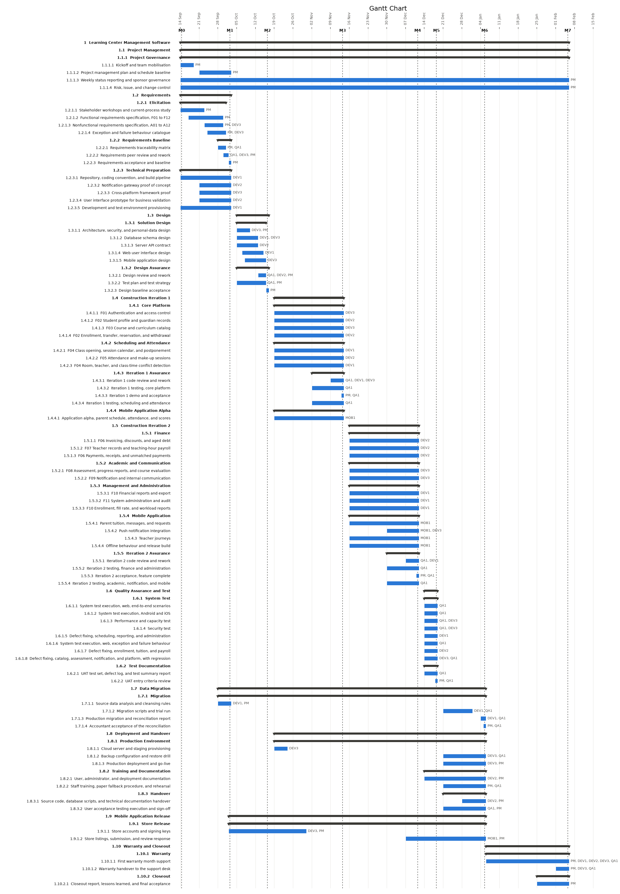
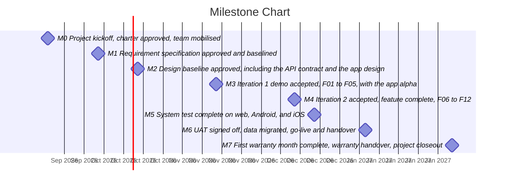

# 2.18 Project Schedule

**Project:** Development and Deployment of a Learning Center Management Software
**Date prepared:** 29 September 2026
**Source:** A Project Manager's Book of Forms, 3rd edition, form 2.18, pages 78 to 81

*Reading convention. This schedule is the output of PMBOK 6 section 6.5 Develop Schedule and is
built from the scope baseline: every row of page 1 is a line of the WBS in
`scope-package.en.md` Part 2, and every work package start and finish is the Due Dates field of its
WBS dictionary sheet in Part 3. Summary rows for the project, the major deliverables and the control
accounts run from the earliest start to the latest finish below them. Page 2 carries the charter's
summary milestones M0 to M7; its Indicator column is the printed chart's icon column, and every milestone reads Fixed date because the charter milestone dates are fixed and not renegotiated in planning (dictionary sheet 1.1.1.2). The Resource Name column is what the printed chart writes next to each
bar: the work package's Responsible Person first, then every other resource with hours on that
sheet. <mark>Highlighted</mark> dates are first-pass estimates that are re-baselined at M1, as the
dictionary and the charter state. Dependency arrows are not drawn: the activity list (2.12) and the
network diagram (2.15) that would supply them have not been produced, so the only sequencing shown is
the milestone gates, drawn as dashed lines M0 to M7. The form is generated by `tools/schedule.py`
from those two documents; change them and rerun the script rather than editing this file. The
project runs from Mon 14 September 2026 to Fri 5 February 2027. The dates are not yet resource-levelled: spreading each sheet's hours evenly over its package's working days puts a resource above 40 hours in 32 resource-weeks, the worst being QA1 at 276 hours in the week of Mon 14 December 2026. Levelling may move package dates and, where a gate cannot hold the work, a milestone, which is a charter change for the sponsor.*

#### PROJECT SCHEDULE, page 1 of 2

| ID | WBS | Task Name | Start | Finish | Resource Name |
| --- | --- | --- | --- | --- | --- |
| 1 | **1** | **Learning Center Management Software** | <mark>Mon 14 September 2026</mark> | <mark>Fri 5 February 2027</mark> |  |
| 2 | **1.1** | **Project Management** | <mark>Mon 14 September 2026</mark> | <mark>Fri 5 February 2027</mark> |  |
| 3 | **1.1.1** | **Project Governance** | <mark>Mon 14 September 2026</mark> | <mark>Fri 5 February 2027</mark> |  |
| 4 | 1.1.1.1 | Kickoff and team mobilisation | <mark>Mon 14 September 2026</mark> | <mark>Fri 18 September 2026</mark> | PM |
| 5 | 1.1.1.2 | Project management plan and schedule baseline | <mark>Mon 21 September 2026</mark> | <mark>Fri 2 October 2026</mark> | PM |
| 6 | 1.1.1.3 | Weekly status reporting and sponsor governance | <mark>Mon 14 September 2026</mark> | <mark>Fri 5 February 2027</mark> | PM |
| 7 | 1.1.1.4 | Risk, issue, and change control | <mark>Mon 14 September 2026</mark> | <mark>Fri 5 February 2027</mark> | PM |
| 8 | **1.2** | **Requirements** | <mark>Mon 14 September 2026</mark> | <mark>Fri 2 October 2026</mark> |  |
| 9 | **1.2.1** | **Elicitation** | <mark>Mon 14 September 2026</mark> | <mark>Wed 30 September 2026</mark> |  |
| 10 | 1.2.1.1 | Stakeholder workshops and current-process study | <mark>Mon 14 September 2026</mark> | <mark>Tue 22 September 2026</mark> | PM |
| 11 | 1.2.1.2 | Functional requirements specification, F01 to F12 | <mark>Thu 17 September 2026</mark> | <mark>Tue 29 September 2026</mark> | PM |
| 12 | 1.2.1.3 | Nonfunctional requirements specification, A01 to A12 | <mark>Wed 23 September 2026</mark> | <mark>Tue 29 September 2026</mark> | PM, DEV3 |
| 13 | 1.2.1.4 | Exception and failure behaviour catalogue | <mark>Thu 24 September 2026</mark> | <mark>Wed 30 September 2026</mark> | PM, DEV3 |
| 14 | **1.2.2** | **Requirements Baseline** | <mark>Mon 28 September 2026</mark> | <mark>Fri 2 October 2026</mark> |  |
| 15 | 1.2.2.1 | Requirements traceability matrix | <mark>Mon 28 September 2026</mark> | <mark>Wed 30 September 2026</mark> | PM, QA1 |
| 16 | 1.2.2.2 | Requirements peer review and rework | <mark>Wed 30 September 2026</mark> | <mark>Thu 1 October 2026</mark> | QA1, DEV3, PM |
| 17 | 1.2.2.3 | Requirements acceptance and baseline | <mark>Fri 2 October 2026</mark> | <mark>Fri 2 October 2026</mark> | PM |
| 18 | **1.2.3** | **Technical Preparation** | <mark>Mon 14 September 2026</mark> | <mark>Fri 2 October 2026</mark> |  |
| 19 | 1.2.3.1 | Repository, coding convention, and build pipeline | <mark>Mon 14 September 2026</mark> | <mark>Fri 2 October 2026</mark> | DEV1 |
| 20 | 1.2.3.2 | Notification gateway proof of concept | <mark>Mon 21 September 2026</mark> | <mark>Fri 2 October 2026</mark> | DEV2 |
| 21 | 1.2.3.3 | Cross-platform framework proof | <mark>Mon 21 September 2026</mark> | <mark>Fri 2 October 2026</mark> | DEV3 |
| 22 | 1.2.3.4 | User interface prototype for business validation | <mark>Mon 21 September 2026</mark> | <mark>Fri 2 October 2026</mark> | DEV2 |
| 23 | 1.2.3.5 | Development and test environment provisioning | <mark>Mon 14 September 2026</mark> | <mark>Fri 2 October 2026</mark> | DEV1 |
| 24 | **1.3** | **Design** | <mark>Mon 5 October 2026</mark> | <mark>Fri 16 October 2026</mark> |  |
| 25 | **1.3.1** | **Solution Design** | <mark>Mon 5 October 2026</mark> | <mark>Thu 15 October 2026</mark> |  |
| 26 | 1.3.1.1 | Architecture, security, and personal-data design | <mark>Mon 5 October 2026</mark> | <mark>Fri 9 October 2026</mark> | DEV3, PM |
| 27 | 1.3.1.2 | Database schema design | <mark>Mon 5 October 2026</mark> | <mark>Mon 12 October 2026</mark> | DEV1, DEV3 |
| 28 | 1.3.1.3 | Server API contract | <mark>Mon 5 October 2026</mark> | <mark>Mon 12 October 2026</mark> | DEV2 |
| 29 | 1.3.1.4 | Web user interface design | <mark>Wed 7 October 2026</mark> | <mark>Wed 14 October 2026</mark> | DEV1 |
| 30 | 1.3.1.5 | Mobile application design | <mark>Thu 8 October 2026</mark> | <mark>Thu 15 October 2026</mark> | DEV3 |
| 31 | **1.3.2** | **Design Assurance** | <mark>Mon 5 October 2026</mark> | <mark>Fri 16 October 2026</mark> |  |
| 32 | 1.3.2.1 | Design review and rework | <mark>Tue 13 October 2026</mark> | <mark>Thu 15 October 2026</mark> | QA1, DEV2, PM |
| 33 | 1.3.2.2 | Test plan and test strategy | <mark>Mon 5 October 2026</mark> | <mark>Thu 15 October 2026</mark> | QA1, PM |
| 34 | 1.3.2.3 | Design baseline acceptance | <mark>Fri 16 October 2026</mark> | <mark>Fri 16 October 2026</mark> | PM |
| 35 | **1.4** | **Construction Iteration 1** | <mark>Mon 19 October 2026</mark> | <mark>Fri 13 November 2026</mark> |  |
| 36 | **1.4.1** | **Core Platform** | <mark>Mon 19 October 2026</mark> | <mark>Fri 13 November 2026</mark> |  |
| 37 | 1.4.1.1 | F01 Authentication and access control | <mark>Mon 19 October 2026</mark> | <mark>Fri 13 November 2026</mark> | DEV3 |
| 38 | 1.4.1.2 | F02 Student profile and guardian records | <mark>Mon 19 October 2026</mark> | <mark>Fri 13 November 2026</mark> | DEV2 |
| 39 | 1.4.1.3 | F03 Course and curriculum catalog | <mark>Mon 19 October 2026</mark> | <mark>Fri 13 November 2026</mark> | DEV3 |
| 40 | 1.4.1.4 | F02 Enrollment, transfer, reservation, and withdrawal | <mark>Mon 19 October 2026</mark> | <mark>Fri 13 November 2026</mark> | DEV2 |
| 41 | **1.4.2** | **Scheduling and Attendance** | <mark>Mon 19 October 2026</mark> | <mark>Fri 13 November 2026</mark> |  |
| 42 | 1.4.2.1 | F04 Class opening, session calendar, and postponement | <mark>Mon 19 October 2026</mark> | <mark>Fri 13 November 2026</mark> | DEV1 |
| 43 | 1.4.2.2 | F05 Attendance and make-up sessions | <mark>Mon 19 October 2026</mark> | <mark>Fri 13 November 2026</mark> | DEV2 |
| 44 | 1.4.2.3 | F04 Room, teacher, and class-time conflict detection | <mark>Mon 19 October 2026</mark> | <mark>Fri 13 November 2026</mark> | DEV1 |
| 45 | **1.4.3** | **Iteration 1 Assurance** | <mark>Mon 2 November 2026</mark> | <mark>Fri 13 November 2026</mark> |  |
| 46 | 1.4.3.1 | Iteration 1 code review and rework | <mark>Mon 9 November 2026</mark> | <mark>Fri 13 November 2026</mark> | QA1, DEV1, DEV3 |
| 47 | 1.4.3.2 | Iteration 1 testing, core platform | <mark>Mon 2 November 2026</mark> | <mark>Fri 13 November 2026</mark> | QA1 |
| 48 | 1.4.3.3 | Iteration 1 demo and acceptance | <mark>Fri 13 November 2026</mark> | <mark>Fri 13 November 2026</mark> | PM, QA1 |
| 49 | 1.4.3.4 | Iteration 1 testing, scheduling and attendance | <mark>Mon 2 November 2026</mark> | <mark>Fri 13 November 2026</mark> | QA1 |
| 50 | **1.4.4** | **Mobile Application Alpha** | <mark>Mon 19 October 2026</mark> | <mark>Fri 13 November 2026</mark> |  |
| 51 | 1.4.4.1 | Application alpha, parent schedule, attendance, and scores | <mark>Mon 19 October 2026</mark> | <mark>Fri 13 November 2026</mark> | MOB1 |
| 52 | **1.5** | **Construction Iteration 2** | <mark>Mon 16 November 2026</mark> | <mark>Fri 11 December 2026</mark> |  |
| 53 | **1.5.1** | **Finance** | <mark>Mon 16 November 2026</mark> | <mark>Fri 11 December 2026</mark> |  |
| 54 | 1.5.1.1 | F06 Invoicing, discounts, and aged debt | <mark>Mon 16 November 2026</mark> | <mark>Fri 11 December 2026</mark> | DEV2 |
| 55 | 1.5.1.2 | F07 Teacher records and teaching-hour payroll | <mark>Mon 16 November 2026</mark> | <mark>Fri 11 December 2026</mark> | DEV2 |
| 56 | 1.5.1.3 | F06 Payments, receipts, and unmatched payments | <mark>Mon 16 November 2026</mark> | <mark>Fri 11 December 2026</mark> | DEV2 |
| 57 | **1.5.2** | **Academic and Communication** | <mark>Mon 16 November 2026</mark> | <mark>Fri 11 December 2026</mark> |  |
| 58 | 1.5.2.1 | F08 Assessment, progress reports, and course evaluation | <mark>Mon 16 November 2026</mark> | <mark>Fri 11 December 2026</mark> | DEV3 |
| 59 | 1.5.2.2 | F09 Notification and internal communication | <mark>Mon 16 November 2026</mark> | <mark>Fri 11 December 2026</mark> | DEV3 |
| 60 | **1.5.3** | **Management and Administration** | <mark>Mon 16 November 2026</mark> | <mark>Fri 11 December 2026</mark> |  |
| 61 | 1.5.3.1 | F10 Financial reports and export | <mark>Mon 16 November 2026</mark> | <mark>Fri 11 December 2026</mark> | DEV1 |
| 62 | 1.5.3.2 | F11 System administration and audit | <mark>Mon 16 November 2026</mark> | <mark>Fri 11 December 2026</mark> | DEV1 |
| 63 | 1.5.3.3 | F10 Enrollment, fill rate, and workload reports | <mark>Mon 16 November 2026</mark> | <mark>Fri 11 December 2026</mark> | DEV1 |
| 64 | **1.5.4** | **Mobile Application** | <mark>Mon 16 November 2026</mark> | <mark>Fri 11 December 2026</mark> |  |
| 65 | 1.5.4.1 | Parent tuition, messages, and requests | <mark>Mon 16 November 2026</mark> | <mark>Fri 11 December 2026</mark> | MOB1 |
| 66 | 1.5.4.2 | Push notification integration | <mark>Mon 30 November 2026</mark> | <mark>Fri 11 December 2026</mark> | MOB1, DEV3 |
| 67 | 1.5.4.3 | Teacher journeys | <mark>Mon 16 November 2026</mark> | <mark>Fri 11 December 2026</mark> | MOB1 |
| 68 | 1.5.4.4 | Offline behaviour and release build | <mark>Mon 16 November 2026</mark> | <mark>Fri 11 December 2026</mark> | MOB1 |
| 69 | **1.5.5** | **Iteration 2 Assurance** | <mark>Mon 30 November 2026</mark> | <mark>Fri 11 December 2026</mark> |  |
| 70 | 1.5.5.1 | Iteration 2 code review and rework | <mark>Mon 7 December 2026</mark> | <mark>Fri 11 December 2026</mark> | QA1, DEV1 |
| 71 | 1.5.5.2 | Iteration 2 testing, finance and administration | <mark>Mon 30 November 2026</mark> | <mark>Fri 11 December 2026</mark> | QA1 |
| 72 | 1.5.5.3 | Iteration 2 acceptance, feature complete | <mark>Fri 11 December 2026</mark> | <mark>Fri 11 December 2026</mark> | PM, QA1 |
| 73 | 1.5.5.4 | Iteration 2 testing, academic, notification, and mobile | <mark>Mon 30 November 2026</mark> | <mark>Fri 11 December 2026</mark> | QA1 |
| 74 | **1.6** | **Quality Assurance and Test** | <mark>Mon 14 December 2026</mark> | <mark>Fri 18 December 2026</mark> |  |
| 75 | **1.6.1** | **System Test** | <mark>Mon 14 December 2026</mark> | <mark>Fri 18 December 2026</mark> |  |
| 76 | 1.6.1.1 | System test execution, web, end-to-end scenarios | <mark>Mon 14 December 2026</mark> | <mark>Fri 18 December 2026</mark> | QA1 |
| 77 | 1.6.1.2 | System test execution, Android and iOS | <mark>Mon 14 December 2026</mark> | <mark>Fri 18 December 2026</mark> | QA1 |
| 78 | 1.6.1.3 | Performance and capacity test | <mark>Mon 14 December 2026</mark> | <mark>Fri 18 December 2026</mark> | QA1, DEV3 |
| 79 | 1.6.1.4 | Security test | <mark>Mon 14 December 2026</mark> | <mark>Fri 18 December 2026</mark> | QA1, DEV3 |
| 80 | 1.6.1.5 | Defect fixing, scheduling, reporting, and administration | <mark>Mon 14 December 2026</mark> | <mark>Fri 18 December 2026</mark> | DEV1 |
| 81 | 1.6.1.6 | System test execution, web, exception and failure behaviour | <mark>Mon 14 December 2026</mark> | <mark>Fri 18 December 2026</mark> | QA1 |
| 82 | 1.6.1.7 | Defect fixing, enrollment, tuition, and payroll | <mark>Mon 14 December 2026</mark> | <mark>Fri 18 December 2026</mark> | DEV2 |
| 83 | 1.6.1.8 | Defect fixing, catalog, assessment, notification, and platform, with regression | <mark>Mon 14 December 2026</mark> | <mark>Fri 18 December 2026</mark> | DEV3, QA1 |
| 84 | **1.6.2** | **Test Documentation** | <mark>Mon 14 December 2026</mark> | <mark>Fri 18 December 2026</mark> |  |
| 85 | 1.6.2.1 | UAT test set, defect log, and test summary report | <mark>Mon 14 December 2026</mark> | <mark>Fri 18 December 2026</mark> | QA1 |
| 86 | 1.6.2.2 | UAT entry criteria review | <mark>Fri 18 December 2026</mark> | <mark>Fri 18 December 2026</mark> | PM, QA1 |
| 87 | **1.7** | **Data Migration** | <mark>Mon 28 September 2026</mark> | <mark>Tue 5 January 2027</mark> |  |
| 88 | **1.7.1** | **Migration** | <mark>Mon 28 September 2026</mark> | <mark>Tue 5 January 2027</mark> |  |
| 89 | 1.7.1.1 | Source data analysis and cleansing rules | <mark>Mon 28 September 2026</mark> | <mark>Fri 2 October 2026</mark> | DEV1, PM |
| 90 | 1.7.1.2 | Migration scripts and trial run | <mark>Mon 21 December 2026</mark> | <mark>Thu 31 December 2026</mark> | DEV1, QA1 |
| 91 | 1.7.1.3 | Production migration and reconciliation report | <mark>Mon 4 January 2027</mark> | <mark>Tue 5 January 2027</mark> | DEV1, QA1 |
| 92 | 1.7.1.4 | Accountant acceptance of the reconciliation | <mark>Tue 5 January 2027</mark> | <mark>Tue 5 January 2027</mark> | PM, QA1 |
| 93 | **1.8** | **Deployment and Handover** | <mark>Mon 19 October 2026</mark> | <mark>Tue 5 January 2027</mark> |  |
| 94 | **1.8.1** | **Production Environment** | <mark>Mon 19 October 2026</mark> | <mark>Tue 5 January 2027</mark> |  |
| 95 | 1.8.1.1 | Cloud server and staging provisioning | <mark>Mon 19 October 2026</mark> | <mark>Fri 23 October 2026</mark> | DEV3 |
| 96 | 1.8.1.2 | Backup configuration and restore drill | <mark>Mon 21 December 2026</mark> | <mark>Tue 5 January 2027</mark> | DEV3, QA1 |
| 97 | 1.8.1.3 | Production deployment and go-live | <mark>Mon 21 December 2026</mark> | <mark>Tue 5 January 2027</mark> | DEV3, PM |
| 98 | **1.8.2** | **Training and Documentation** | <mark>Mon 14 December 2026</mark> | <mark>Tue 5 January 2027</mark> |  |
| 99 | 1.8.2.1 | User, administrator, and deployment documentation | <mark>Mon 14 December 2026</mark> | <mark>Tue 5 January 2027</mark> | DEV2, PM |
| 100 | 1.8.2.2 | Staff training, paper fallback procedure, and rehearsal | <mark>Mon 21 December 2026</mark> | <mark>Tue 5 January 2027</mark> | PM, QA1 |
| 101 | **1.8.3** | **Handover** | <mark>Mon 21 December 2026</mark> | <mark>Tue 5 January 2027</mark> |  |
| 102 | 1.8.3.1 | Source code, database scripts, and technical documentation handover | <mark>Mon 28 December 2026</mark> | <mark>Tue 5 January 2027</mark> | DEV2, PM |
| 103 | 1.8.3.2 | User acceptance testing execution and sign-off | <mark>Mon 21 December 2026</mark> | <mark>Tue 5 January 2027</mark> | QA1, PM |
| 104 | **1.9** | **Mobile Application Release** | <mark>Fri 2 October 2026</mark> | <mark>Tue 5 January 2027</mark> |  |
| 105 | **1.9.1** | **Store Release** | <mark>Fri 2 October 2026</mark> | <mark>Tue 5 January 2027</mark> |  |
| 106 | 1.9.1.1 | Store accounts and signing keys | <mark>Fri 2 October 2026</mark> | <mark>Fri 30 October 2026</mark> | DEV3, PM |
| 107 | 1.9.1.2 | Store listings, submission, and review response | <mark>Mon 7 December 2026</mark> | <mark>Tue 5 January 2027</mark> | MOB1, PM |
| 108 | **1.10** | **Warranty and Closeout** | <mark>Wed 6 January 2027</mark> | <mark>Fri 5 February 2027</mark> |  |
| 109 | **1.10.1** | **Warranty** | <mark>Wed 6 January 2027</mark> | <mark>Fri 5 February 2027</mark> |  |
| 110 | 1.10.1.1 | First warranty month support | <mark>Wed 6 January 2027</mark> | <mark>Fri 5 February 2027</mark> | PM, DEV1, DEV2, DEV3, QA1 |
| 111 | 1.10.1.2 | Warranty handover to the support desk | <mark>Mon 1 February 2027</mark> | <mark>Fri 5 February 2027</mark> | PM, DEV3, QA1 |
| 112 | **1.10.2** | **Closeout** | <mark>Mon 25 January 2027</mark> | <mark>Fri 5 February 2027</mark> |  |
| 113 | 1.10.2.1 | Closeout report, lessons learned, and final acceptance | <mark>Mon 25 January 2027</mark> | <mark>Fri 5 February 2027</mark> | PM |

```mermaid
gantt
    title Gantt Chart
    dateFormat YYYY-MM-DD
    axisFormat %d %b
    excludes weekends
    section 1.1 Project Management
    1.1.1.1 Kickoff and team mobilisation, PM :2026-09-14, 2026-09-19
    1.1.1.2 Project management plan and schedule baseline, PM :2026-09-21, 2026-10-03
    1.1.1.3 Weekly status reporting and sponsor governance, PM :2026-09-14, 2027-02-06
    1.1.1.4 Risk, issue, and change control, PM :2026-09-14, 2027-02-06
    section 1.2 Requirements
    1.2.1.1 Stakeholder workshops and current-process study, PM :2026-09-14, 2026-09-23
    1.2.1.2 Functional requirements specification, F01 to F12, PM :2026-09-17, 2026-09-30
    1.2.1.3 Nonfunctional requirements specification, A01 to A12, PM, DEV3 :2026-09-23, 2026-09-30
    1.2.1.4 Exception and failure behaviour catalogue, PM, DEV3 :2026-09-24, 2026-10-01
    1.2.2.1 Requirements traceability matrix, PM, QA1 :2026-09-28, 2026-10-01
    1.2.2.2 Requirements peer review and rework, QA1, DEV3, PM :2026-09-30, 2026-10-02
    1.2.2.3 Requirements acceptance and baseline, PM :2026-10-02, 2026-10-03
    1.2.3.1 Repository, coding convention, and build pipeline, DEV1 :2026-09-14, 2026-10-03
    1.2.3.2 Notification gateway proof of concept, DEV2 :2026-09-21, 2026-10-03
    1.2.3.3 Cross-platform framework proof, DEV3 :2026-09-21, 2026-10-03
    1.2.3.4 User interface prototype for business validation, DEV2 :2026-09-21, 2026-10-03
    1.2.3.5 Development and test environment provisioning, DEV1 :2026-09-14, 2026-10-03
    section 1.3 Design
    1.3.1.1 Architecture, security, and personal-data design, DEV3, PM :2026-10-05, 2026-10-10
    1.3.1.2 Database schema design, DEV1, DEV3 :2026-10-05, 2026-10-13
    1.3.1.3 Server API contract, DEV2 :2026-10-05, 2026-10-13
    1.3.1.4 Web user interface design, DEV1 :2026-10-07, 2026-10-15
    1.3.1.5 Mobile application design, DEV3 :2026-10-08, 2026-10-16
    1.3.2.1 Design review and rework, QA1, DEV2, PM :2026-10-13, 2026-10-16
    1.3.2.2 Test plan and test strategy, QA1, PM :2026-10-05, 2026-10-16
    1.3.2.3 Design baseline acceptance, PM :2026-10-16, 2026-10-17
    section 1.4 Construction Iteration 1
    1.4.1.1 F01 Authentication and access control, DEV3 :2026-10-19, 2026-11-14
    1.4.1.2 F02 Student profile and guardian records, DEV2 :2026-10-19, 2026-11-14
    1.4.1.3 F03 Course and curriculum catalog, DEV3 :2026-10-19, 2026-11-14
    1.4.1.4 F02 Enrollment, transfer, reservation, and withdrawal, DEV2 :2026-10-19, 2026-11-14
    1.4.2.1 F04 Class opening, session calendar, and postponement, DEV1 :2026-10-19, 2026-11-14
    1.4.2.2 F05 Attendance and make-up sessions, DEV2 :2026-10-19, 2026-11-14
    1.4.2.3 F04 Room, teacher, and class-time conflict detection, DEV1 :2026-10-19, 2026-11-14
    1.4.3.1 Iteration 1 code review and rework, QA1, DEV1, DEV3 :2026-11-09, 2026-11-14
    1.4.3.2 Iteration 1 testing, core platform, QA1 :2026-11-02, 2026-11-14
    1.4.3.3 Iteration 1 demo and acceptance, PM, QA1 :2026-11-13, 2026-11-14
    1.4.3.4 Iteration 1 testing, scheduling and attendance, QA1 :2026-11-02, 2026-11-14
    1.4.4.1 Application alpha, parent schedule, attendance, and scores, MOB1 :2026-10-19, 2026-11-14
    section 1.5 Construction Iteration 2
    1.5.1.1 F06 Invoicing, discounts, and aged debt, DEV2 :2026-11-16, 2026-12-12
    1.5.1.2 F07 Teacher records and teaching-hour payroll, DEV2 :2026-11-16, 2026-12-12
    1.5.1.3 F06 Payments, receipts, and unmatched payments, DEV2 :2026-11-16, 2026-12-12
    1.5.2.1 F08 Assessment, progress reports, and course evaluation, DEV3 :2026-11-16, 2026-12-12
    1.5.2.2 F09 Notification and internal communication, DEV3 :2026-11-16, 2026-12-12
    1.5.3.1 F10 Financial reports and export, DEV1 :2026-11-16, 2026-12-12
    1.5.3.2 F11 System administration and audit, DEV1 :2026-11-16, 2026-12-12
    1.5.3.3 F10 Enrollment, fill rate, and workload reports, DEV1 :2026-11-16, 2026-12-12
    1.5.4.1 Parent tuition, messages, and requests, MOB1 :2026-11-16, 2026-12-12
    1.5.4.2 Push notification integration, MOB1, DEV3 :2026-11-30, 2026-12-12
    1.5.4.3 Teacher journeys, MOB1 :2026-11-16, 2026-12-12
    1.5.4.4 Offline behaviour and release build, MOB1 :2026-11-16, 2026-12-12
    1.5.5.1 Iteration 2 code review and rework, QA1, DEV1 :2026-12-07, 2026-12-12
    1.5.5.2 Iteration 2 testing, finance and administration, QA1 :2026-11-30, 2026-12-12
    1.5.5.3 Iteration 2 acceptance, feature complete, PM, QA1 :2026-12-11, 2026-12-12
    1.5.5.4 Iteration 2 testing, academic, notification, and mobile, QA1 :2026-11-30, 2026-12-12
    section 1.6 Quality Assurance and Test
    1.6.1.1 System test execution, web, end-to-end scenarios, QA1 :2026-12-14, 2026-12-19
    1.6.1.2 System test execution, Android and iOS, QA1 :2026-12-14, 2026-12-19
    1.6.1.3 Performance and capacity test, QA1, DEV3 :2026-12-14, 2026-12-19
    1.6.1.4 Security test, QA1, DEV3 :2026-12-14, 2026-12-19
    1.6.1.5 Defect fixing, scheduling, reporting, and administration, DEV1 :2026-12-14, 2026-12-19
    1.6.1.6 System test execution, web, exception and failure behaviour, QA1 :2026-12-14, 2026-12-19
    1.6.1.7 Defect fixing, enrollment, tuition, and payroll, DEV2 :2026-12-14, 2026-12-19
    1.6.1.8 Defect fixing, catalog, assessment, notification, and platform, with regression, DEV3, QA1 :2026-12-14, 2026-12-19
    1.6.2.1 UAT test set, defect log, and test summary report, QA1 :2026-12-14, 2026-12-19
    1.6.2.2 UAT entry criteria review, PM, QA1 :2026-12-18, 2026-12-19
    section 1.7 Data Migration
    1.7.1.1 Source data analysis and cleansing rules, DEV1, PM :2026-09-28, 2026-10-03
    1.7.1.2 Migration scripts and trial run, DEV1, QA1 :2026-12-21, 2027-01-01
    1.7.1.3 Production migration and reconciliation report, DEV1, QA1 :2027-01-04, 2027-01-06
    1.7.1.4 Accountant acceptance of the reconciliation, PM, QA1 :2027-01-05, 2027-01-06
    section 1.8 Deployment and Handover
    1.8.1.1 Cloud server and staging provisioning, DEV3 :2026-10-19, 2026-10-24
    1.8.1.2 Backup configuration and restore drill, DEV3, QA1 :2026-12-21, 2027-01-06
    1.8.1.3 Production deployment and go-live, DEV3, PM :2026-12-21, 2027-01-06
    1.8.2.1 User, administrator, and deployment documentation, DEV2, PM :2026-12-14, 2027-01-06
    1.8.2.2 Staff training, paper fallback procedure, and rehearsal, PM, QA1 :2026-12-21, 2027-01-06
    1.8.3.1 Source code, database scripts, and technical documentation handover, DEV2, PM :2026-12-28, 2027-01-06
    1.8.3.2 User acceptance testing execution and sign-off, QA1, PM :2026-12-21, 2027-01-06
    section 1.9 Mobile Application Release
    1.9.1.1 Store accounts and signing keys, DEV3, PM :2026-10-02, 2026-10-31
    1.9.1.2 Store listings, submission, and review response, MOB1, PM :2026-12-07, 2027-01-06
    section 1.10 Warranty and Closeout
    1.10.1.1 First warranty month support, PM, DEV1, DEV2, DEV3, QA1 :2027-01-06, 2027-02-06
    1.10.1.2 Warranty handover to the support desk, PM, DEV3, QA1 :2027-02-01, 2027-02-06
    1.10.2.1 Closeout report, lessons learned, and final acceptance, PM :2027-01-25, 2027-02-06
    section Milestones
    M0 :milestone, 2026-09-14, 0d
    M1 :milestone, 2026-10-02, 0d
    M2 :milestone, 2026-10-16, 0d
    M3 :milestone, 2026-11-13, 0d
    M4 :milestone, 2026-12-11, 0d
    M5 :milestone, 2026-12-18, 0d
    M6 :milestone, 2027-01-05, 0d
    M7 :milestone, 2027-02-05, 0d
```

#### PROJECT SCHEDULE, page 2 of 2

| ID | Indicator | Task Name | Finish |
| --- | --- | --- | --- |
| 1 | Fixed date | M0 Project kickoff, charter approved, team mobilised | <mark>Mon 14 September 2026</mark> |
| 2 | Fixed date | M1 Requirement specification approved and baselined | <mark>Fri 2 October 2026</mark> |
| 3 | Fixed date | M2 Design baseline approved, including the API contract and the app design | <mark>Fri 16 October 2026</mark> |
| 4 | Fixed date | M3 Iteration 1 demo accepted, F01 to F05, with the app alpha | <mark>Fri 13 November 2026</mark> |
| 5 | Fixed date | M4 Iteration 2 accepted, feature complete, F06 to F12 | <mark>Fri 11 December 2026</mark> |
| 6 | Fixed date | M5 System test complete on web, Android, and iOS; UAT entry criteria met; app submitted to both stores | <mark>Fri 18 December 2026</mark> |
| 7 | Fixed date | M6 UAT signed off, data migrated, go-live and handover; app live in both stores | <mark>Tue 5 January 2027</mark> |
| 8 | Fixed date | M7 First warranty month complete, warranty handover, project closeout | <mark>Fri 5 February 2027</mark> |

