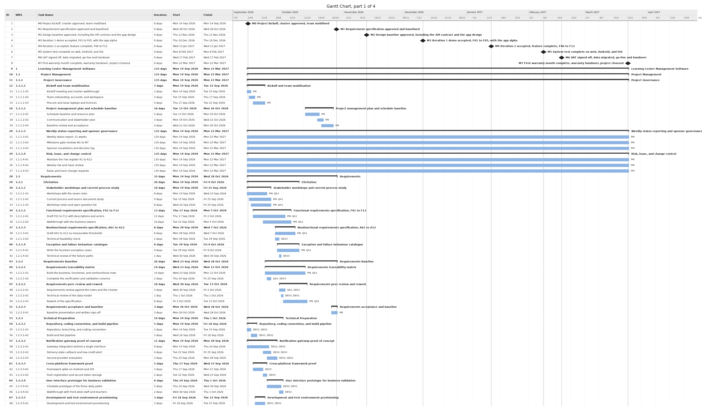
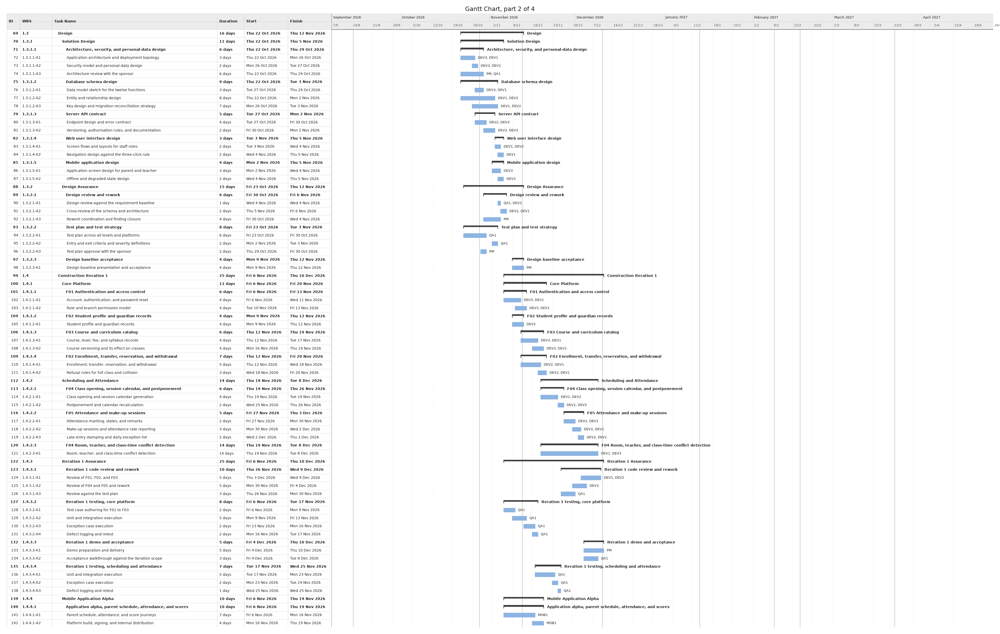
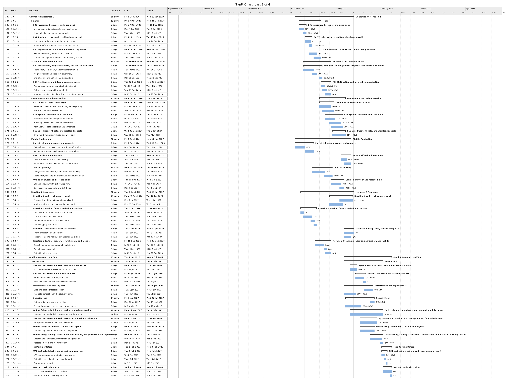
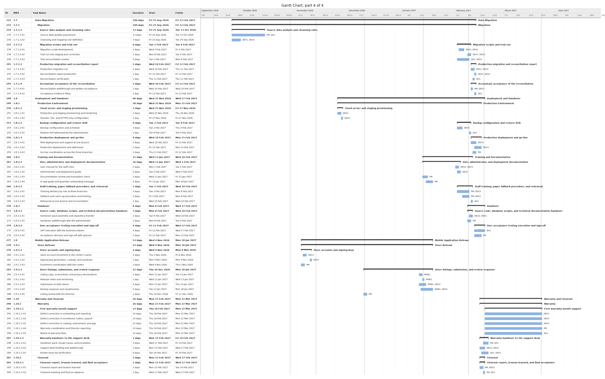
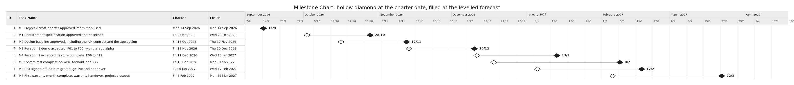
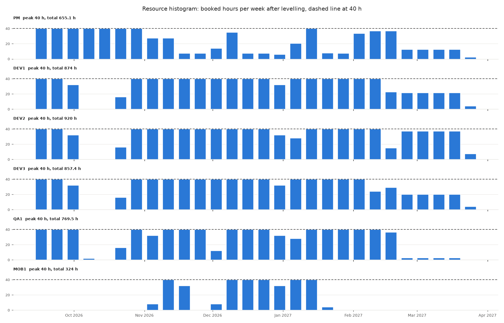

# 2.18 Project Schedule

**Project:** Development and Deployment of a Learning Center Management Software
**Date prepared:** 29 September 2026
**Source:** A Project Manager's Book of Forms, 3rd edition, form 2.18, pages 78 to 81

*Reading convention. This schedule is the output of PMBOK 6 section 6.5 Develop Schedule. It is
resource-levelled (6.5.2.3): every activity of the WBS dictionary in `scope-package.en.md` keeps the
hours its sheet gives it, and is placed day by day into its people's working time, at most
8 hours a working day, weekends and New Year's Day excluded. Where an activity finishes earlier
when divided, a second person takes up to half of it: developers help each other and QA1, DEV3
helps MOB1, and QA1 or DEV3 help the project manager with requirements work, as the charter's
response to risk R9 already provides; 97 activities are divided, and their rows name both
people with their hours. Governance and acceptance packages are never divided. Work may start up to
5 working days before the gate that releases it, which is fast tracking (6.5.2.6). Page 1 is the Gantt
chart in 4 parts: the milestones at their levelled forecast as 0-day rows, then the WBS, each work
package with its activities below it; Duration counts working days. Page 2 is the milestone chart,
each milestone at its levelled forecast beside its charter date. <mark>Highlighted</mark> dates are
the levelled forecast. The forecast moves M6 and M7 past the dates the charter imposes, so
the milestones are not baselined until the sponsor decides change request `3-3-change-request.en.md`;
until then the charter and the dictionary keep their dates. The Lunar New Year break of 2027 is not
in the calendar, because the charter dates its first day but not its length (assumption 8), and
the forecast crosses it. Dependency arrows are not drawn: the order kept is each package's gate and,
inside a control account, the order the dictionary dates give, since the activity list (2.12) and
the network diagram (2.15) have not been produced. The form is generated by `tools/schedule.py`;
change the source documents and rerun it rather than editing this file. The levelled project runs
from Mon 14 September 2026 to Mon 22 March 2027.*

#### PROJECT SCHEDULE, page 1 of 2

| ID | WBS | Task Name | Duration | Start | Finish | Resource Name |
| --- | --- | --- | --- | --- | --- | --- |
| 1 |  | M0 Project kickoff, charter approved, team mobilised | 0 days | <mark>Mon 14 September 2026</mark> | <mark>Mon 14 September 2026</mark> |  |
| 2 |  | M1 Requirement specification approved and baselined | 0 days | <mark>Wed 28 October 2026</mark> | <mark>Wed 28 October 2026</mark> |  |
| 3 |  | M2 Design baseline approved, including the API contract and the app design | 0 days | <mark>Thu 12 November 2026</mark> | <mark>Thu 12 November 2026</mark> |  |
| 4 |  | M3 Iteration 1 demo accepted, F01 to F05, with the app alpha | 0 days | <mark>Thu 10 December 2026</mark> | <mark>Thu 10 December 2026</mark> |  |
| 5 |  | M4 Iteration 2 accepted, feature complete, F06 to F12 | 0 days | <mark>Wed 13 January 2027</mark> | <mark>Wed 13 January 2027</mark> |  |
| 6 |  | M5 System test complete on web, Android, and iOS | 0 days | <mark>Mon 8 February 2027</mark> | <mark>Mon 8 February 2027</mark> |  |
| 7 |  | M6 UAT signed off, data migrated, go-live and handover | 0 days | <mark>Wed 17 February 2027</mark> | <mark>Wed 17 February 2027</mark> |  |
| 8 |  | M7 First warranty month complete, warranty handover, project closeout | 0 days | <mark>Mon 22 March 2027</mark> | <mark>Mon 22 March 2027</mark> |  |
| 9 | **1** | **Learning Center Management Software** | 135 days | <mark>Mon 14 September 2026</mark> | <mark>Mon 22 March 2027</mark> |  |
| 10 | **1.1** | **Project Management** | 135 days | <mark>Mon 14 September 2026</mark> | <mark>Mon 22 March 2027</mark> |  |
| 11 | **1.1.1** | **Project Governance** | 135 days | <mark>Mon 14 September 2026</mark> | <mark>Mon 22 March 2027</mark> |  |
| 12 | **1.1.1.1** | **Kickoff and team mobilisation** | 7 days | <mark>Mon 14 September 2026</mark> | <mark>Tue 22 September 2026</mark> | PM |
| 13 | 1.1.1.1-A1 | Kickoff meeting and charter walkthrough | 2 days | <mark>Mon 14 September 2026</mark> | <mark>Tue 15 September 2026</mark> | PM |
| 14 | 1.1.1.1-A2 | Team onboarding, accounts, and workspace | 3 days | <mark>Tue 15 September 2026</mark> | <mark>Thu 17 September 2026</mark> | PM |
| 15 | 1.1.1.1-A3 | Procure and issue laptops and licences | 4 days | <mark>Thu 17 September 2026</mark> | <mark>Tue 22 September 2026</mark> | PM |
| 16 | **1.1.1.2** | **Project management plan and schedule baseline** | 10 days | <mark>Tue 13 October 2026</mark> | <mark>Mon 26 October 2026</mark> | PM |
| 17 | 1.1.1.2-A1 | Schedule baseline and resource plan | 5 days | <mark>Tue 13 October 2026</mark> | <mark>Mon 19 October 2026</mark> | PM |
| 18 | 1.1.1.2-A2 | Communication and stakeholder plan | 3 days | <mark>Mon 19 October 2026</mark> | <mark>Wed 21 October 2026</mark> | PM |
| 19 | 1.1.1.2-A3 | Baseline review and acceptance | 4 days | <mark>Wed 21 October 2026</mark> | <mark>Mon 26 October 2026</mark> | PM |
| 20 | **1.1.1.3** | **Weekly status reporting and sponsor governance** | 135 days | <mark>Mon 14 September 2026</mark> | <mark>Mon 22 March 2027</mark> | PM |
| 21 | 1.1.1.3-A1 | Weekly status report, 21 weeks | 135 days | <mark>Mon 14 September 2026</mark> | <mark>Mon 22 March 2027</mark> | PM |
| 22 | 1.1.1.3-A2 | Milestone gate reviews M1 to M7 | 135 days | <mark>Mon 14 September 2026</mark> | <mark>Mon 22 March 2027</mark> | PM |
| 23 | 1.1.1.3-A3 | Sponsor escalations and decision log | 135 days | <mark>Mon 14 September 2026</mark> | <mark>Mon 22 March 2027</mark> | PM |
| 24 | **1.1.1.4** | **Risk, issue, and change control** | 135 days | <mark>Mon 14 September 2026</mark> | <mark>Mon 22 March 2027</mark> | PM |
| 25 | 1.1.1.4-A1 | Maintain the risk register R1 to R12 | 135 days | <mark>Mon 14 September 2026</mark> | <mark>Mon 22 March 2027</mark> | PM |
| 26 | 1.1.1.4-A2 | Weekly risk and issue review | 135 days | <mark>Mon 14 September 2026</mark> | <mark>Mon 22 March 2027</mark> | PM |
| 27 | 1.1.1.4-A3 | Raise and track change requests | 135 days | <mark>Mon 14 September 2026</mark> | <mark>Mon 22 March 2027</mark> | PM |
| 28 | **1.2** | **Requirements** | 33 days | <mark>Mon 14 September 2026</mark> | <mark>Wed 28 October 2026</mark> |  |
| 29 | **1.2.1** | **Elicitation** | 20 days | <mark>Mon 14 September 2026</mark> | <mark>Fri 9 October 2026</mark> |  |
| 30 | **1.2.1.1** | **Stakeholder workshops and current-process study** | 10 days | <mark>Mon 14 September 2026</mark> | <mark>Fri 25 September 2026</mark> | PM, QA1 |
| 31 | 1.2.1.1-A1 | Workshops with the seven roles | 8 days | <mark>Mon 14 September 2026</mark> | <mark>Wed 23 September 2026</mark> | PM 12 h, QA1 12 h |
| 32 | 1.2.1.1-A2 | Current process and source document study | 9 days | <mark>Tue 15 September 2026</mark> | <mark>Fri 25 September 2026</mark> | PM 8 h, QA1 8 h |
| 33 | 1.2.1.1-A3 | Workshop notes and open question list | 8 days | <mark>Wed 16 September 2026</mark> | <mark>Fri 25 September 2026</mark> | PM 4 h, QA1 4 h |
| 34 | **1.2.1.2** | **Functional requirements specification, F01 to F12** | 13 days | <mark>Thu 17 September 2026</mark> | <mark>Mon 5 October 2026</mark> | PM, QA1 |
| 35 | 1.2.1.2-A1 | Draft F01 to F12 with descriptions and actors | 12 days | <mark>Thu 17 September 2026</mark> | <mark>Fri 2 October 2026</mark> | PM 28 h, QA1 28 h |
| 36 | 1.2.1.2-A2 | Walkthrough with the business owners | 10 days | <mark>Tue 22 September 2026</mark> | <mark>Mon 5 October 2026</mark> | PM 8 h, QA1 8 h |
| 37 | **1.2.1.3** | **Nonfunctional requirements specification, A01 to A12** | 8 days | <mark>Mon 28 September 2026</mark> | <mark>Wed 7 October 2026</mark> | PM, DEV3, QA1 |
| 38 | 1.2.1.3-A1 | Draft A01 to A12 as measurable thresholds | 8 days | <mark>Mon 28 September 2026</mark> | <mark>Wed 7 October 2026</mark> | PM 12 h, QA1 12 h |
| 39 | 1.2.1.3-A2 | Technical feasibility check | 2 days | <mark>Mon 28 September 2026</mark> | <mark>Tue 29 September 2026</mark> | DEV3 |
| 40 | **1.2.1.4** | **Exception and failure behaviour catalogue** | 9 days | <mark>Tue 29 September 2026</mark> | <mark>Fri 9 October 2026</mark> | PM, DEV3, QA1 |
| 41 | 1.2.1.4-A1 | Write the fourteen exception cases | 9 days | <mark>Tue 29 September 2026</mark> | <mark>Fri 9 October 2026</mark> | PM 12 h, QA1 12 h |
| 42 | 1.2.1.4-A2 | Technical review of the failure paths | 1 day | <mark>Wed 30 September 2026</mark> | <mark>Wed 30 September 2026</mark> | DEV3 |
| 43 | **1.2.2** | **Requirements Baseline** | 26 days | <mark>Wed 23 September 2026</mark> | <mark>Wed 28 October 2026</mark> |  |
| 44 | **1.2.2.1** | **Requirements traceability matrix** | 14 days | <mark>Wed 23 September 2026</mark> | <mark>Mon 12 October 2026</mark> | PM, DEV3, QA1 |
| 45 | 1.2.2.1-A1 | Build the business, functional, and nonfunctional rows | 14 days | <mark>Wed 23 September 2026</mark> | <mark>Mon 12 October 2026</mark> | PM 8 h, QA1 8 h |
| 46 | 1.2.2.1-A2 | Complete the verification and validation columns | 2 days | <mark>Thu 24 September 2026</mark> | <mark>Fri 25 September 2026</mark> | QA1 8 h, DEV3 8 h |
| 47 | **1.2.2.2** | **Requirements peer review and rework** | 10 days | <mark>Wed 30 September 2026</mark> | <mark>Tue 13 October 2026</mark> | QA1, DEV1, DEV3, PM |
| 48 | 1.2.2.2-A1 | Requirements review against the notes and the charter | 3 days | <mark>Wed 30 September 2026</mark> | <mark>Fri 2 October 2026</mark> | QA1 12 h, DEV1 12 h |
| 49 | 1.2.2.2-A2 | Technical review of the data model | 1 day | <mark>Thu 1 October 2026</mark> | <mark>Thu 1 October 2026</mark> | DEV3 8 h, DEV1 4 h |
| 50 | 1.2.2.2-A3 | Rework of the specification | 8 days | <mark>Fri 2 October 2026</mark> | <mark>Tue 13 October 2026</mark> | PM 4 h, QA1 4 h |
| 51 | **1.2.2.3** | **Requirements acceptance and baseline** | 3 days | <mark>Mon 26 October 2026</mark> | <mark>Wed 28 October 2026</mark> | PM |
| 52 | 1.2.2.3-A1 | Baseline presentation and written sign-off | 3 days | <mark>Mon 26 October 2026</mark> | <mark>Wed 28 October 2026</mark> | PM |
| 53 | **1.2.3** | **Technical Preparation** | 14 days | <mark>Mon 14 September 2026</mark> | <mark>Thu 1 October 2026</mark> |  |
| 54 | **1.2.3.1** | **Repository, coding convention, and build pipeline** | 5 days | <mark>Mon 14 September 2026</mark> | <mark>Fri 18 September 2026</mark> | DEV1, DEV2 |
| 55 | 1.2.3.1-A1 | Repository, branching, and coding convention | 2 days | <mark>Mon 14 September 2026</mark> | <mark>Tue 15 September 2026</mark> | DEV1 16 h, DEV2 16 h |
| 56 | 1.2.3.1-A2 | Build and test pipeline | 3 days | <mark>Wed 16 September 2026</mark> | <mark>Fri 18 September 2026</mark> | DEV1 24 h, DEV2 16 h |
| 57 | **1.2.3.2** | **Notification gateway proof of concept** | 11 days | <mark>Mon 14 September 2026</mark> | <mark>Mon 28 September 2026</mark> | DEV2, DEV1, DEV3 |
| 58 | 1.2.3.2-A1 | Gateway integration behind a single interface | 9 days | <mark>Mon 14 September 2026</mark> | <mark>Thu 24 September 2026</mark> | DEV2 24 h, DEV3 24 h |
| 59 | 1.2.3.2-A2 | Delivery-state callback and low-credit alert | 4 days | <mark>Tue 22 September 2026</mark> | <mark>Fri 25 September 2026</mark> | DEV2 10 h, DEV1 10 h |
| 60 | 1.2.3.2-A3 | Second provider evaluation | 3 days | <mark>Thu 24 September 2026</mark> | <mark>Mon 28 September 2026</mark> | DEV2 6 h, DEV1 6 h |
| 61 | **1.2.3.3** | **Cross-platform framework proof** | 5 days | <mark>Thu 17 September 2026</mark> | <mark>Wed 23 September 2026</mark> | DEV3 |
| 62 | 1.2.3.3-A1 | Framework spike on Android and iOS | 3 days | <mark>Thu 17 September 2026</mark> | <mark>Mon 21 September 2026</mark> | DEV3 |
| 63 | 1.2.3.3-A2 | Push registration and secure token storage | 2 days | <mark>Tue 22 September 2026</mark> | <mark>Wed 23 September 2026</mark> | DEV3 |
| 64 | **1.2.3.4** | **User interface prototype for business validation** | 6 days | <mark>Thu 24 September 2026</mark> | <mark>Thu 1 October 2026</mark> | DEV2, DEV1 |
| 65 | 1.2.3.4-A1 | Clickable prototype of the three daily paths | 5 days | <mark>Thu 24 September 2026</mark> | <mark>Wed 30 September 2026</mark> | DEV2 14 h, DEV1 14 h |
| 66 | 1.2.3.4-A2 | Walkthrough with front-desk staff and teachers | 2 days | <mark>Wed 30 September 2026</mark> | <mark>Thu 1 October 2026</mark> | DEV2 |
| 67 | **1.2.3.5** | **Development and test environment provisioning** | 3 days | <mark>Fri 18 September 2026</mark> | <mark>Tue 22 September 2026</mark> | DEV1, DEV2 |
| 68 | 1.2.3.5-A1 | Development and test environment provisioning | 3 days | <mark>Fri 18 September 2026</mark> | <mark>Tue 22 September 2026</mark> | DEV1 14 h, DEV2 14 h |
| 69 | **1.3** | **Design** | 16 days | <mark>Thu 22 October 2026</mark> | <mark>Thu 12 November 2026</mark> |  |
| 70 | **1.3.1** | **Solution Design** | 11 days | <mark>Thu 22 October 2026</mark> | <mark>Thu 5 November 2026</mark> |  |
| 71 | **1.3.1.1** | **Architecture, security, and personal-data design** | 6 days | <mark>Thu 22 October 2026</mark> | <mark>Thu 29 October 2026</mark> | DEV3, DEV1, PM, QA1 |
| 72 | 1.3.1.1-A1 | Application architecture and deployment topology | 3 days | <mark>Thu 22 October 2026</mark> | <mark>Mon 26 October 2026</mark> | DEV3 20 h, DEV1 16 h |
| 73 | 1.3.1.1-A2 | Security model and personal-data design | 2 days | <mark>Mon 26 October 2026</mark> | <mark>Tue 27 October 2026</mark> | DEV3 12 h, DEV1 12 h |
| 74 | 1.3.1.1-A3 | Architecture review with the sponsor | 6 days | <mark>Thu 22 October 2026</mark> | <mark>Thu 29 October 2026</mark> | PM 8 h, QA1 8 h |
| 75 | **1.3.1.2** | **Database schema design** | 9 days | <mark>Thu 22 October 2026</mark> | <mark>Tue 3 November 2026</mark> | DEV1, DEV2, DEV3 |
| 76 | 1.3.1.2-A1 | Data model sketch for the twelve functions | 3 days | <mark>Tue 27 October 2026</mark> | <mark>Thu 29 October 2026</mark> | DEV3 12 h, DEV1 12 h |
| 77 | 1.3.1.2-A2 | Entity and relationship design | 8 days | <mark>Thu 22 October 2026</mark> | <mark>Mon 2 November 2026</mark> | DEV1 18 h, DEV2 18 h |
| 78 | 1.3.1.2-A3 | Key design and migration reconciliation strategy | 7 days | <mark>Mon 26 October 2026</mark> | <mark>Tue 3 November 2026</mark> | DEV1 8 h, DEV2 8 h |
| 79 | **1.3.1.3** | **Server API contract** | 5 days | <mark>Tue 27 October 2026</mark> | <mark>Mon 2 November 2026</mark> | DEV2, DEV3 |
| 80 | 1.3.1.3-A1 | Endpoint design and error contract | 4 days | <mark>Tue 27 October 2026</mark> | <mark>Fri 30 October 2026</mark> | DEV2 30 h, DEV3 6 h |
| 81 | 1.3.1.3-A2 | Versioning, authorisation rules, and documentation | 2 days | <mark>Fri 30 October 2026</mark> | <mark>Mon 2 November 2026</mark> | DEV2 8 h, DEV3 8 h |
| 82 | **1.3.1.4** | **Web user interface design** | 3 days | <mark>Tue 3 November 2026</mark> | <mark>Thu 5 November 2026</mark> | DEV1, DEV2 |
| 83 | 1.3.1.4-A1 | Screen flows and layouts for staff roles | 2 days | <mark>Tue 3 November 2026</mark> | <mark>Wed 4 November 2026</mark> | DEV1 12 h, DEV2 8 h |
| 84 | 1.3.1.4-A2 | Navigation design against the three-click rule | 2 days | <mark>Wed 4 November 2026</mark> | <mark>Thu 5 November 2026</mark> | DEV1 |
| 85 | **1.3.1.5** | **Mobile application design** | 4 days | <mark>Mon 2 November 2026</mark> | <mark>Thu 5 November 2026</mark> | DEV3 |
| 86 | 1.3.1.5-A1 | Application screen design for parent and teacher | 3 days | <mark>Mon 2 November 2026</mark> | <mark>Wed 4 November 2026</mark> | DEV3 |
| 87 | 1.3.1.5-A2 | Offline and degraded-state design | 2 days | <mark>Wed 4 November 2026</mark> | <mark>Thu 5 November 2026</mark> | DEV3 |
| 88 | **1.3.2** | **Design Assurance** | 15 days | <mark>Fri 23 October 2026</mark> | <mark>Thu 12 November 2026</mark> |  |
| 89 | **1.3.2.1** | **Design review and rework** | 6 days | <mark>Fri 30 October 2026</mark> | <mark>Fri 6 November 2026</mark> | QA1, DEV1, DEV2, PM |
| 90 | 1.3.2.1-A1 | Design review against the requirement baseline | 1 day | <mark>Wed 4 November 2026</mark> | <mark>Wed 4 November 2026</mark> | QA1 8 h, DEV2 8 h |
| 91 | 1.3.2.1-A2 | Cross-review of the schema and architecture | 2 days | <mark>Thu 5 November 2026</mark> | <mark>Fri 6 November 2026</mark> | DEV2 16 h, DEV1 4 h |
| 92 | 1.3.2.1-A3 | Rework coordination and finding closure | 4 days | <mark>Fri 30 October 2026</mark> | <mark>Wed 4 November 2026</mark> | PM |
| 93 | **1.3.2.2** | **Test plan and test strategy** | 8 days | <mark>Fri 23 October 2026</mark> | <mark>Tue 3 November 2026</mark> | QA1, PM |
| 94 | 1.3.2.2-A1 | Test plan across all levels and platforms | 6 days | <mark>Fri 23 October 2026</mark> | <mark>Fri 30 October 2026</mark> | QA1 |
| 95 | 1.3.2.2-A2 | Entry and exit criteria and severity definitions | 2 days | <mark>Mon 2 November 2026</mark> | <mark>Tue 3 November 2026</mark> | QA1 |
| 96 | 1.3.2.2-A3 | Test plan approval with the sponsor | 2 days | <mark>Thu 29 October 2026</mark> | <mark>Fri 30 October 2026</mark> | PM |
| 97 | **1.3.2.3** | **Design baseline acceptance** | 4 days | <mark>Mon 9 November 2026</mark> | <mark>Thu 12 November 2026</mark> | PM |
| 98 | 1.3.2.3-A1 | Design baseline presentation and acceptance | 4 days | <mark>Mon 9 November 2026</mark> | <mark>Thu 12 November 2026</mark> | PM |
| 99 | **1.4** | **Construction Iteration 1** | 25 days | <mark>Fri 6 November 2026</mark> | <mark>Thu 10 December 2026</mark> |  |
| 100 | **1.4.1** | **Core Platform** | 11 days | <mark>Fri 6 November 2026</mark> | <mark>Fri 20 November 2026</mark> |  |
| 101 | **1.4.1.1** | **F01 Authentication and access control** | 6 days | <mark>Fri 6 November 2026</mark> | <mark>Fri 13 November 2026</mark> | DEV3, DEV1 |
| 102 | 1.4.1.1-A1 | Account, authentication, and password reset | 4 days | <mark>Fri 6 November 2026</mark> | <mark>Wed 11 November 2026</mark> | DEV3 16 h, DEV1 16 h |
| 103 | 1.4.1.1-A2 | Role and branch permission model | 4 days | <mark>Tue 10 November 2026</mark> | <mark>Fri 13 November 2026</mark> | DEV3 14 h, DEV1 14 h |
| 104 | **1.4.1.2** | **F02 Student profile and guardian records** | 4 days | <mark>Mon 9 November 2026</mark> | <mark>Thu 12 November 2026</mark> | DEV2 |
| 105 | 1.4.1.2-A1 | Student profile and guardian records | 4 days | <mark>Mon 9 November 2026</mark> | <mark>Thu 12 November 2026</mark> | DEV2 |
| 106 | **1.4.1.3** | **F03 Course and curriculum catalog** | 6 days | <mark>Thu 12 November 2026</mark> | <mark>Thu 19 November 2026</mark> | DEV3, DEV1 |
| 107 | 1.4.1.3-A1 | Course, level, fee, and syllabus records | 4 days | <mark>Thu 12 November 2026</mark> | <mark>Tue 17 November 2026</mark> | DEV3 16 h, DEV1 16 h |
| 108 | 1.4.1.3-A2 | Course versioning and its effect on classes | 4 days | <mark>Mon 16 November 2026</mark> | <mark>Thu 19 November 2026</mark> | DEV3 14 h, DEV1 14 h |
| 109 | **1.4.1.4** | **F02 Enrollment, transfer, reservation, and withdrawal** | 7 days | <mark>Thu 12 November 2026</mark> | <mark>Fri 20 November 2026</mark> | DEV2, DEV1 |
| 110 | 1.4.1.4-A1 | Enrollment, transfer, reservation, and withdrawal | 5 days | <mark>Thu 12 November 2026</mark> | <mark>Wed 18 November 2026</mark> | DEV2 34 h, DEV1 6 h |
| 111 | 1.4.1.4-A2 | Refusal rules for full class and collision | 3 days | <mark>Wed 18 November 2026</mark> | <mark>Fri 20 November 2026</mark> | DEV2 10 h, DEV1 10 h |
| 112 | **1.4.2** | **Scheduling and Attendance** | 14 days | <mark>Thu 19 November 2026</mark> | <mark>Tue 8 December 2026</mark> |  |
| 113 | **1.4.2.1** | **F04 Class opening, session calendar, and postponement** | 6 days | <mark>Thu 19 November 2026</mark> | <mark>Thu 26 November 2026</mark> | DEV1, DEV2 |
| 114 | 1.4.2.1-A1 | Class opening and session calendar generation | 4 days | <mark>Thu 19 November 2026</mark> | <mark>Tue 24 November 2026</mark> | DEV1 26 h, DEV2 22 h |
| 115 | 1.4.2.1-A2 | Postponement and calendar recalculation | 2 days | <mark>Wed 25 November 2026</mark> | <mark>Thu 26 November 2026</mark> | DEV1 16 h, DEV2 16 h |
| 116 | **1.4.2.2** | **F05 Attendance and make-up sessions** | 5 days | <mark>Fri 27 November 2026</mark> | <mark>Thu 3 December 2026</mark> | DEV2, DEV1 |
| 117 | 1.4.2.2-A1 | Attendance marking, states, and remarks | 2 days | <mark>Fri 27 November 2026</mark> | <mark>Mon 30 November 2026</mark> | DEV2 16 h, DEV1 14 h |
| 118 | 1.4.2.2-A2 | Make-up sessions and attendance rate reporting | 3 days | <mark>Mon 30 November 2026</mark> | <mark>Wed 2 December 2026</mark> | DEV2 14 h, DEV1 10 h |
| 119 | 1.4.2.2-A3 | Late-entry stamping and daily exception list | 2 days | <mark>Wed 2 December 2026</mark> | <mark>Thu 3 December 2026</mark> | DEV2 8 h, DEV1 8 h |
| 120 | **1.4.2.3** | **F04 Room, teacher, and class-time conflict detection** | 14 days | <mark>Thu 19 November 2026</mark> | <mark>Tue 8 December 2026</mark> | DEV1, DEV3 |
| 121 | 1.4.2.3-A1 | Room, teacher, and class-time conflict detection | 14 days | <mark>Thu 19 November 2026</mark> | <mark>Tue 8 December 2026</mark> | DEV1 30 h, DEV3 30 h |
| 122 | **1.4.3** | **Iteration 1 Assurance** | 25 days | <mark>Fri 6 November 2026</mark> | <mark>Thu 10 December 2026</mark> |  |
| 123 | **1.4.3.1** | **Iteration 1 code review and rework** | 10 days | <mark>Thu 26 November 2026</mark> | <mark>Wed 9 December 2026</mark> | QA1, DEV1, DEV2, DEV3 |
| 124 | 1.4.3.1-A1 | Review of F01, F02, and F03 | 5 days | <mark>Thu 3 December 2026</mark> | <mark>Wed 9 December 2026</mark> | DEV1 10 h, DEV2 10 h |
| 125 | 1.4.3.1-A2 | Review of F04 and F05 and rework | 5 days | <mark>Mon 30 November 2026</mark> | <mark>Fri 4 December 2026</mark> | DEV3 |
| 126 | 1.4.3.1-A3 | Review against the test plan | 3 days | <mark>Thu 26 November 2026</mark> | <mark>Mon 30 November 2026</mark> | QA1 |
| 127 | **1.4.3.2** | **Iteration 1 testing, core platform** | 8 days | <mark>Fri 6 November 2026</mark> | <mark>Tue 17 November 2026</mark> | QA1 |
| 128 | 1.4.3.2-A1 | Test case authoring for F01 to F03 | 2 days | <mark>Fri 6 November 2026</mark> | <mark>Mon 9 November 2026</mark> | QA1 |
| 129 | 1.4.3.2-A2 | Unit and integration execution | 5 days | <mark>Mon 9 November 2026</mark> | <mark>Fri 13 November 2026</mark> | QA1 |
| 130 | 1.4.3.2-A3 | Exception case execution | 2 days | <mark>Fri 13 November 2026</mark> | <mark>Mon 16 November 2026</mark> | QA1 |
| 131 | 1.4.3.2-A4 | Defect logging and retest | 2 days | <mark>Mon 16 November 2026</mark> | <mark>Tue 17 November 2026</mark> | QA1 |
| 132 | **1.4.3.3** | **Iteration 1 demo and acceptance** | 5 days | <mark>Fri 4 December 2026</mark> | <mark>Thu 10 December 2026</mark> | PM, QA1 |
| 133 | 1.4.3.3-A1 | Demo preparation and delivery | 5 days | <mark>Fri 4 December 2026</mark> | <mark>Thu 10 December 2026</mark> | PM |
| 134 | 1.4.3.3-A2 | Acceptance walkthrough against the iteration scope | 3 days | <mark>Fri 4 December 2026</mark> | <mark>Tue 8 December 2026</mark> | QA1 |
| 135 | **1.4.3.4** | **Iteration 1 testing, scheduling and attendance** | 7 days | <mark>Tue 17 November 2026</mark> | <mark>Wed 25 November 2026</mark> | QA1 |
| 136 | 1.4.3.4-A1 | Unit and integration execution | 5 days | <mark>Tue 17 November 2026</mark> | <mark>Mon 23 November 2026</mark> | QA1 |
| 137 | 1.4.3.4-A2 | Exception case execution | 2 days | <mark>Mon 23 November 2026</mark> | <mark>Tue 24 November 2026</mark> | QA1 |
| 138 | 1.4.3.4-A3 | Defect logging and retest | 1 day | <mark>Wed 25 November 2026</mark> | <mark>Wed 25 November 2026</mark> | QA1 |
| 139 | **1.4.4** | **Mobile Application Alpha** | 10 days | <mark>Fri 6 November 2026</mark> | <mark>Thu 19 November 2026</mark> |  |
| 140 | **1.4.4.1** | **Application alpha, parent schedule, attendance, and scores** | 10 days | <mark>Fri 6 November 2026</mark> | <mark>Thu 19 November 2026</mark> | MOB1 |
| 141 | 1.4.4.1-A1 | Parent schedule, attendance, and score journeys | 7 days | <mark>Fri 6 November 2026</mark> | <mark>Mon 16 November 2026</mark> | MOB1 |
| 142 | 1.4.4.1-A2 | Platform build, signing, and internal distribution | 4 days | <mark>Mon 16 November 2026</mark> | <mark>Thu 19 November 2026</mark> | MOB1 |
| 143 | **1.5** | **Construction Iteration 2** | 28 days | <mark>Fri 4 December 2026</mark> | <mark>Wed 13 January 2027</mark> |  |
| 144 | **1.5.1** | **Finance** | 11 days | <mark>Mon 7 December 2026</mark> | <mark>Mon 21 December 2026</mark> |  |
| 145 | **1.5.1.1** | **F06 Invoicing, discounts, and aged debt** | 5 days | <mark>Mon 7 December 2026</mark> | <mark>Fri 11 December 2026</mark> | DEV2, DEV1, DEV3 |
| 146 | 1.5.1.1-A1 | Invoice generation, discounts, and installments | 3 days | <mark>Mon 7 December 2026</mark> | <mark>Wed 9 December 2026</mark> | DEV2 24 h, DEV3 24 h |
| 147 | 1.5.1.1-A2 | Aged debt list per student and branch | 2 days | <mark>Thu 10 December 2026</mark> | <mark>Fri 11 December 2026</mark> | DEV2 14 h, DEV1 8 h |
| 148 | **1.5.1.2** | **F07 Teacher records and teaching-hour payroll** | 3 days | <mark>Fri 11 December 2026</mark> | <mark>Tue 15 December 2026</mark> | DEV2, DEV1 |
| 149 | 1.5.1.2-A1 | Teacher records, rates, and the monthly sheet | 2 days | <mark>Fri 11 December 2026</mark> | <mark>Mon 14 December 2026</mark> | DEV2 10 h, DEV1 8 h |
| 150 | 1.5.1.2-A2 | Sheet workflow, approval separation, and export | 2 days | <mark>Mon 14 December 2026</mark> | <mark>Tue 15 December 2026</mark> | DEV2 6 h, DEV1 6 h |
| 151 | **1.5.1.3** | **F06 Payments, receipts, and unmatched payments** | 6 days | <mark>Mon 14 December 2026</mark> | <mark>Mon 21 December 2026</mark> | DEV2, DEV1 |
| 152 | 1.5.1.3-A1 | Payment recording, receipts, and balance | 5 days | <mark>Mon 14 December 2026</mark> | <mark>Fri 18 December 2026</mark> | DEV2 20 h, DEV1 20 h |
| 153 | 1.5.1.3-A2 | Unmatched payments, credits, and reversing entries | 3 days | <mark>Thu 17 December 2026</mark> | <mark>Mon 21 December 2026</mark> | DEV2 10 h, DEV1 10 h |
| 154 | **1.5.2** | **Academic and Communication** | 13 days | <mark>Thu 10 December 2026</mark> | <mark>Mon 28 December 2026</mark> |  |
| 155 | **1.5.2.1** | **F08 Assessment, progress reports, and course evaluation** | 9 days | <mark>Thu 10 December 2026</mark> | <mark>Tue 22 December 2026</mark> | DEV3, DEV1 |
| 156 | 1.5.2.1-A1 | Score entry, comments, and result computation | 5 days | <mark>Thu 10 December 2026</mark> | <mark>Wed 16 December 2026</mark> | DEV3 |
| 157 | 1.5.2.1-A2 | Progress report and class result summary | 3 days | <mark>Wed 16 December 2026</mark> | <mark>Fri 18 December 2026</mark> | DEV3 20 h, DEV1 4 h |
| 158 | 1.5.2.1-A3 | End-of-course evaluation and its reporting | 2 days | <mark>Mon 21 December 2026</mark> | <mark>Tue 22 December 2026</mark> | DEV3 12 h, DEV1 8 h |
| 159 | **1.5.2.2** | **F09 Notification and internal communication** | 5 days | <mark>Tue 22 December 2026</mark> | <mark>Mon 28 December 2026</mark> | DEV3, DEV1 |
| 160 | 1.5.2.2-A1 | Templates, manual send, and scheduled send | 3 days | <mark>Tue 22 December 2026</mark> | <mark>Thu 24 December 2026</mark> | DEV3 14 h, DEV1 14 h |
| 161 | 1.5.2.2-A2 | Delivery log, retry, and low-credit alert | 3 days | <mark>Wed 23 December 2026</mark> | <mark>Fri 25 December 2026</mark> | DEV3 10 h, DEV1 10 h |
| 162 | 1.5.2.2-A3 | Announcements, notice board, and parent messages | 2 days | <mark>Fri 25 December 2026</mark> | <mark>Mon 28 December 2026</mark> | DEV3 |
| 163 | **1.5.3** | **Management and Administration** | 13 days | <mark>Mon 21 December 2026</mark> | <mark>Thu 7 January 2027</mark> |  |
| 164 | **1.5.3.1** | **F10 Financial reports and export** | 8 days | <mark>Mon 21 December 2026</mark> | <mark>Wed 30 December 2026</mark> | DEV1, DEV2 |
| 165 | 1.5.3.1-A1 | Revenue, collection, and outstanding debt reporting | 6 days | <mark>Mon 21 December 2026</mark> | <mark>Mon 28 December 2026</mark> | DEV1 16 h, DEV2 16 h |
| 166 | 1.5.3.1-A2 | Filters and Excel and PDF export | 6 days | <mark>Wed 23 December 2026</mark> | <mark>Wed 30 December 2026</mark> | DEV1 12 h, DEV2 12 h |
| 167 | **1.5.3.2** | **F11 System administration and audit** | 7 days | <mark>Fri 25 December 2026</mark> | <mark>Tue 5 January 2027</mark> | DEV1, DEV2 |
| 168 | 1.5.3.2-A1 | Reference data and configuration screens | 5 days | <mark>Fri 25 December 2026</mark> | <mark>Thu 31 December 2026</mark> | DEV1 10 h, DEV2 10 h |
| 169 | 1.5.3.2-A2 | Audit log over financial and student writes | 5 days | <mark>Mon 28 December 2026</mark> | <mark>Mon 4 January 2027</mark> | DEV1 9 h, DEV2 9 h |
| 170 | 1.5.3.2-A3 | Administrator data export in an open format | 5 days | <mark>Tue 29 December 2026</mark> | <mark>Tue 5 January 2027</mark> | DEV1 6 h, DEV2 6 h |
| 171 | **1.5.3.3** | **F10 Enrollment, fill rate, and workload reports** | 6 days | <mark>Wed 30 December 2026</mark> | <mark>Thu 7 January 2027</mark> | DEV1, DEV2 |
| 172 | 1.5.3.3-A1 | Enrollment, retention, fill rate, and workload | 6 days | <mark>Wed 30 December 2026</mark> | <mark>Thu 7 January 2027</mark> | DEV1 17 h, DEV2 17 h |
| 173 | **1.5.4** | **Mobile Application** | 26 days | <mark>Fri 4 December 2026</mark> | <mark>Mon 11 January 2027</mark> |  |
| 174 | **1.5.4.1** | **Parent tuition, messages, and requests** | 9 days | <mark>Fri 4 December 2026</mark> | <mark>Wed 16 December 2026</mark> | MOB1 |
| 175 | 1.5.4.1-A1 | Tuition balance, invoices, and transfer confirmation | 5 days | <mark>Fri 4 December 2026</mark> | <mark>Thu 10 December 2026</mark> | MOB1 |
| 176 | 1.5.4.1-A2 | Messages, make-up, evaluation, and re-enrollment | 4 days | <mark>Fri 11 December 2026</mark> | <mark>Wed 16 December 2026</mark> | MOB1 |
| 177 | **1.5.4.2** | **Push notification integration** | 5 days | <mark>Tue 5 January 2027</mark> | <mark>Mon 11 January 2027</mark> | MOB1, DEV1, DEV3 |
| 178 | 1.5.4.2-A1 | Device registration and push delivery | 4 days | <mark>Tue 5 January 2027</mark> | <mark>Fri 8 January 2027</mark> | MOB1 21 h, DEV3 19 h |
| 179 | 1.5.4.2-A2 | Server-side channel selection and fallback timer | 3 days | <mark>Thu 7 January 2027</mark> | <mark>Mon 11 January 2027</mark> | DEV3 10 h, DEV1 10 h |
| 180 | **1.5.4.3** | **Teacher journeys** | 10 days | <mark>Wed 16 December 2026</mark> | <mark>Tue 29 December 2026</mark> | MOB1, DEV3 |
| 181 | 1.5.4.3-A1 | Today's sessions, rosters, and attendance marking | 7 days | <mark>Wed 16 December 2026</mark> | <mark>Thu 24 December 2026</mark> | MOB1 |
| 182 | 1.5.4.3-A2 | Score entry, teaching-hour sheet, and announcements | 4 days | <mark>Thu 24 December 2026</mark> | <mark>Tue 29 December 2026</mark> | MOB1 30 h, DEV3 6 h |
| 183 | **1.5.4.4** | **Offline behaviour and release build** | 6 days | <mark>Tue 29 December 2026</mark> | <mark>Wed 6 January 2027</mark> | MOB1, DEV3 |
| 184 | 1.5.4.4-A1 | Offline behaviour with last-synced view | 4 days | <mark>Tue 29 December 2026</mark> | <mark>Mon 4 January 2027</mark> | MOB1 22 h, DEV3 18 h |
| 185 | 1.5.4.4-A2 | Store-ready release build and distribution | 3 days | <mark>Mon 4 January 2027</mark> | <mark>Wed 6 January 2027</mark> | MOB1 13 h, DEV3 13 h |
| 186 | **1.5.5** | **Iteration 2 Assurance** | 26 days | <mark>Tue 8 December 2026</mark> | <mark>Wed 13 January 2027</mark> |  |
| 187 | **1.5.5.1** | **Iteration 2 code review and rework** | 11 days | <mark>Mon 28 December 2026</mark> | <mark>Tue 12 January 2027</mark> | QA1, DEV1, DEV2 |
| 188 | 1.5.5.1-A1 | Cross-review of the tuition and payroll code | 7 days | <mark>Mon 4 January 2027</mark> | <mark>Tue 12 January 2027</mark> | DEV1 10 h, DEV2 10 h |
| 189 | 1.5.5.1-A2 | Review against the test plan and money path | 6 days | <mark>Mon 28 December 2026</mark> | <mark>Tue 5 January 2027</mark> | QA1 |
| 190 | **1.5.5.2** | **Iteration 2 testing, finance and administration** | 9 days | <mark>Tue 8 December 2026</mark> | <mark>Fri 18 December 2026</mark> | QA1 |
| 191 | 1.5.5.2-A1 | Test case authoring for F06, F07, F10, F11 | 2 days | <mark>Tue 8 December 2026</mark> | <mark>Wed 9 December 2026</mark> | QA1 |
| 192 | 1.5.5.2-A2 | Unit and integration execution | 4 days | <mark>Thu 10 December 2026</mark> | <mark>Tue 15 December 2026</mark> | QA1 |
| 193 | 1.5.5.2-A3 | Money-path exception case execution | 3 days | <mark>Tue 15 December 2026</mark> | <mark>Thu 17 December 2026</mark> | QA1 |
| 194 | 1.5.5.2-A4 | Defect logging and retest | 2 days | <mark>Thu 17 December 2026</mark> | <mark>Fri 18 December 2026</mark> | QA1 |
| 195 | **1.5.5.3** | **Iteration 2 acceptance, feature complete** | 5 days | <mark>Thu 7 January 2027</mark> | <mark>Wed 13 January 2027</mark> | PM, QA1 |
| 196 | 1.5.5.3-A1 | Demo preparation and delivery | 5 days | <mark>Thu 7 January 2027</mark> | <mark>Wed 13 January 2027</mark> | PM |
| 197 | 1.5.5.3-A2 | Feature-complete walkthrough against F01 to F12 | 3 days | <mark>Thu 7 January 2027</mark> | <mark>Mon 11 January 2027</mark> | QA1 |
| 198 | **1.5.5.4** | **Iteration 2 testing, academic, notification, and mobile** | 7 days | <mark>Fri 18 December 2026</mark> | <mark>Mon 28 December 2026</mark> | QA1 |
| 199 | 1.5.5.4-A1 | Execution on web and both mobile platforms | 4 days | <mark>Fri 18 December 2026</mark> | <mark>Wed 23 December 2026</mark> | QA1 |
| 200 | 1.5.5.4-A2 | Exception case execution | 2 days | <mark>Thu 24 December 2026</mark> | <mark>Fri 25 December 2026</mark> | QA1 |
| 201 | 1.5.5.4-A3 | Defect logging and retest | 2 days | <mark>Fri 25 December 2026</mark> | <mark>Mon 28 December 2026</mark> | QA1 |
| 202 | **1.6** | **Quality Assurance and Test** | 23 days | <mark>Thu 7 January 2027</mark> | <mark>Mon 8 February 2027</mark> |  |
| 203 | **1.6.1** | **System Test** | 19 days | <mark>Thu 7 January 2027</mark> | <mark>Tue 2 February 2027</mark> |  |
| 204 | **1.6.1.1** | **System test execution, web, end-to-end scenarios** | 5 days | <mark>Mon 11 January 2027</mark> | <mark>Fri 15 January 2027</mark> | QA1, DEV1 |
| 205 | 1.6.1.1-A1 | End-to-end scenario execution across F01 to F12 | 5 days | <mark>Mon 11 January 2027</mark> | <mark>Fri 15 January 2027</mark> | QA1 36 h, DEV1 28 h |
| 206 | **1.6.1.2** | **System test execution, Android and iOS** | 5 days | <mark>Fri 15 January 2027</mark> | <mark>Thu 21 January 2027</mark> | QA1, DEV1 |
| 207 | 1.6.1.2-A1 | Parent and teacher journey execution | 4 days | <mark>Fri 15 January 2027</mark> | <mark>Wed 20 January 2027</mark> | QA1 22 h, DEV1 18 h |
| 208 | 1.6.1.2-A2 | Push, SMS fallback, and offline state execution | 2 days | <mark>Wed 20 January 2027</mark> | <mark>Thu 21 January 2027</mark> | QA1 10 h, DEV1 10 h |
| 209 | **1.6.1.3** | **Performance and capacity test** | 14 days | <mark>Thu 7 January 2027</mark> | <mark>Tue 26 January 2027</mark> | QA1, DEV1, DEV2, DEV3 |
| 210 | 1.6.1.3-A1 | Load and capacity test execution | 4 days | <mark>Thu 21 January 2027</mark> | <mark>Tue 26 January 2027</mark> | QA1 20 h, DEV1 20 h |
| 211 | 1.6.1.3-A2 | Test data generation at the stated volumes | 6 days | <mark>Thu 7 January 2027</mark> | <mark>Thu 14 January 2027</mark> | DEV3 10 h, DEV2 10 h |
| 212 | **1.6.1.4** | **Security test** | 14 days | <mark>Fri 8 January 2027</mark> | <mark>Wed 27 January 2027</mark> | QA1, DEV1, DEV2, DEV3 |
| 213 | 1.6.1.4-A1 | Authorisation and transport testing | 3 days | <mark>Mon 25 January 2027</mark> | <mark>Wed 27 January 2027</mark> | QA1 10 h, DEV1 10 h |
| 214 | 1.6.1.4-A2 | Credential, consent, token, and storage checks | 7 days | <mark>Fri 8 January 2027</mark> | <mark>Mon 18 January 2027</mark> | DEV3 10 h, DEV2 10 h |
| 215 | **1.6.1.5** | **Defect fixing, scheduling, reporting, and administration** | 17 days | <mark>Mon 11 January 2027</mark> | <mark>Tue 2 February 2027</mark> | DEV1, DEV2 |
| 216 | 1.6.1.5-A1 | Defect fixing in scheduling, reporting, administration | 17 days | <mark>Mon 11 January 2027</mark> | <mark>Tue 2 February 2027</mark> | DEV1 40 h, DEV2 40 h |
| 217 | **1.6.1.6** | **System test execution, web, exception and failure behaviour** | 10 days | <mark>Mon 18 January 2027</mark> | <mark>Fri 29 January 2027</mark> | QA1, DEV2 |
| 218 | 1.6.1.6-A1 | Exception and failure behaviour execution | 10 days | <mark>Mon 18 January 2027</mark> | <mark>Fri 29 January 2027</mark> | QA1 18 h, DEV2 18 h |
| 219 | **1.6.1.7** | **Defect fixing, enrollment, tuition, and payroll** | 8 days | <mark>Mon 18 January 2027</mark> | <mark>Wed 27 January 2027</mark> | DEV2, DEV3 |
| 220 | 1.6.1.7-A1 | Defect fixing in enrollment, tuition, and payroll | 8 days | <mark>Mon 18 January 2027</mark> | <mark>Wed 27 January 2027</mark> | DEV2 40 h, DEV3 40 h |
| 221 | **1.6.1.8** | **Defect fixing, catalog, assessment, notification, and platform, with regression** | 7 days | <mark>Mon 25 January 2027</mark> | <mark>Tue 2 February 2027</mark> | DEV3, DEV2, QA1 |
| 222 | 1.6.1.8-A1 | Defect fixing in catalog, assessment, and platform | 6 days | <mark>Mon 25 January 2027</mark> | <mark>Mon 1 February 2027</mark> | DEV3 42 h, DEV2 18 h |
| 223 | 1.6.1.8-A2 | Regression cycle and fix verification | 2 days | <mark>Mon 1 February 2027</mark> | <mark>Tue 2 February 2027</mark> | QA1 12 h, DEV2 8 h |
| 224 | **1.6.2** | **Test Documentation** | 5 days | <mark>Tue 2 February 2027</mark> | <mark>Mon 8 February 2027</mark> |  |
| 225 | **1.6.2.1** | **UAT test set, defect log, and test summary report** | 4 days | <mark>Tue 2 February 2027</mark> | <mark>Fri 5 February 2027</mark> | QA1, DEV1 |
| 226 | 1.6.2.1-A1 | UAT test set agreement with business owners | 2 days | <mark>Tue 2 February 2027</mark> | <mark>Wed 3 February 2027</mark> | QA1 12 h, DEV1 4 h |
| 227 | 1.6.2.1-A2 | Defect log consolidation and trend report | 1 day | <mark>Thu 4 February 2027</mark> | <mark>Thu 4 February 2027</mark> | QA1 |
| 228 | 1.6.2.1-A3 | Test summary report | 1 day | <mark>Fri 5 February 2027</mark> | <mark>Fri 5 February 2027</mark> | QA1 |
| 229 | **1.6.2.2** | **UAT entry criteria review** | 4 days | <mark>Wed 3 February 2027</mark> | <mark>Mon 8 February 2027</mark> | PM, QA1 |
| 230 | 1.6.2.2-A1 | Entry criteria review and go decision | 4 days | <mark>Wed 3 February 2027</mark> | <mark>Mon 8 February 2027</mark> | PM |
| 231 | 1.6.2.2-A2 | Evidence pack for the entry decision | 1 day | <mark>Mon 8 February 2027</mark> | <mark>Mon 8 February 2027</mark> | QA1 |
| 232 | **1.7** | **Data Migration** | 100 days | <mark>Fri 25 September 2026</mark> | <mark>Fri 12 February 2027</mark> |  |
| 233 | **1.7.1** | **Migration** | 100 days | <mark>Fri 25 September 2026</mark> | <mark>Fri 12 February 2027</mark> |  |
| 234 | **1.7.1.1** | **Source data analysis and cleansing rules** | 13 days | <mark>Fri 25 September 2026</mark> | <mark>Tue 13 October 2026</mark> | DEV1, DEV3, PM, QA1 |
| 235 | 1.7.1.1-A1 | Source data quality assessment | 13 days | <mark>Fri 25 September 2026</mark> | <mark>Tue 13 October 2026</mark> | PM 6 h, QA1 6 h |
| 236 | 1.7.1.1-A2 | Cleansing and mapping rule definition | 3 days | <mark>Fri 25 September 2026</mark> | <mark>Tue 29 September 2026</mark> | DEV1 12 h, DEV3 8 h |
| 237 | **1.7.1.2** | **Migration scripts and trial run** | 6 days | <mark>Tue 2 February 2027</mark> | <mark>Tue 9 February 2027</mark> | DEV1, DEV2, DEV3, QA1 |
| 238 | 1.7.1.2-A1 | Migration script development | 3 days | <mark>Wed 3 February 2027</mark> | <mark>Fri 5 February 2027</mark> | DEV1 20 h, DEV2 20 h |
| 239 | 1.7.1.2-A2 | Trial run into staging and correction | 2 days | <mark>Mon 8 February 2027</mark> | <mark>Tue 9 February 2027</mark> | DEV1 12 h, DEV2 8 h |
| 240 | 1.7.1.2-A3 | Trial reconciliation review | 5 days | <mark>Tue 2 February 2027</mark> | <mark>Mon 8 February 2027</mark> | QA1 4 h, DEV3 4 h |
| 241 | **1.7.1.3** | **Production migration and reconciliation report** | 3 days | <mark>Wed 10 February 2027</mark> | <mark>Fri 12 February 2027</mark> | DEV1, DEV2, QA1 |
| 242 | 1.7.1.3-A1 | Production migration run | 2 days | <mark>Wed 10 February 2027</mark> | <mark>Thu 11 February 2027</mark> | DEV1 16 h, DEV2 8 h |
| 243 | 1.7.1.3-A2 | Reconciliation report production | 1 day | <mark>Fri 12 February 2027</mark> | <mark>Fri 12 February 2027</mark> | DEV1 8 h, DEV2 8 h |
| 244 | 1.7.1.3-A3 | Reconciliation verification | 1 day | <mark>Thu 11 February 2027</mark> | <mark>Thu 11 February 2027</mark> | QA1 |
| 245 | **1.7.1.4** | **Accountant acceptance of the reconciliation** | 3 days | <mark>Wed 10 February 2027</mark> | <mark>Fri 12 February 2027</mark> | PM, DEV3, QA1 |
| 246 | 1.7.1.4-A1 | Reconciliation walkthrough and written acceptance | 1 day | <mark>Wed 10 February 2027</mark> | <mark>Wed 10 February 2027</mark> | PM 6.5 h, DEV3 1.5 h |
| 247 | 1.7.1.4-A2 | Acceptance evidence filing | 1 day | <mark>Fri 12 February 2027</mark> | <mark>Fri 12 February 2027</mark> | QA1 |
| 248 | **1.8** | **Deployment and Handover** | 60 days | <mark>Wed 25 November 2026</mark> | <mark>Wed 17 February 2027</mark> |  |
| 249 | **1.8.1** | **Production Environment** | 58 days | <mark>Wed 25 November 2026</mark> | <mark>Mon 15 February 2027</mark> |  |
| 250 | **1.8.1.1** | **Cloud server and staging provisioning** | 3 days | <mark>Wed 25 November 2026</mark> | <mark>Fri 27 November 2026</mark> | DEV3 |
| 251 | 1.8.1.1-A1 | Production and staging provisioning and hardening | 2 days | <mark>Wed 25 November 2026</mark> | <mark>Thu 26 November 2026</mark> | DEV3 |
| 252 | 1.8.1.1-A2 | Domain, SSL, and HTTPS-only configuration | 1 day | <mark>Fri 27 November 2026</mark> | <mark>Fri 27 November 2026</mark> | DEV3 |
| 253 | **1.8.1.2** | **Backup configuration and restore drill** | 6 days | <mark>Tue 2 February 2027</mark> | <mark>Tue 9 February 2027</mark> | DEV3, QA1 |
| 254 | 1.8.1.2-A1 | Backup configuration and schedule | 3 days | <mark>Tue 2 February 2027</mark> | <mark>Thu 4 February 2027</mark> | DEV3 |
| 255 | 1.8.1.2-A2 | Restore drill witnessed by the administrator | 1 day | <mark>Tue 9 February 2027</mark> | <mark>Tue 9 February 2027</mark> | QA1 |
| 256 | **1.8.1.3** | **Production deployment and go-live** | 4 days | <mark>Wed 10 February 2027</mark> | <mark>Mon 15 February 2027</mark> | DEV3, PM |
| 257 | 1.8.1.3-A1 | Pilot deployment and support at one branch | 3 days | <mark>Wed 10 February 2027</mark> | <mark>Fri 12 February 2027</mark> | DEV3 |
| 258 | 1.8.1.3-A2 | Production deployment and switchover | 2 days | <mark>Fri 12 February 2027</mark> | <mark>Mon 15 February 2027</mark> | DEV3 |
| 259 | 1.8.1.3-A3 | Go-live coordination across the three branches | 2 days | <mark>Thu 11 February 2027</mark> | <mark>Fri 12 February 2027</mark> | PM |
| 260 | **1.8.2** | **Training and Documentation** | 21 days | <mark>Wed 13 January 2027</mark> | <mark>Wed 10 February 2027</mark> |  |
| 261 | **1.8.2.1** | **User, administrator, and deployment documentation** | 16 days | <mark>Wed 13 January 2027</mark> | <mark>Wed 3 February 2027</mark> | DEV2, DEV3, PM |
| 262 | 1.8.2.1-A1 | User manual for the staff roles | 2 days | <mark>Mon 1 February 2027</mark> | <mark>Tue 2 February 2027</mark> | DEV2 6 h, DEV3 4 h |
| 263 | 1.8.2.1-A2 | Administrator and deployment guide | 2 days | <mark>Tue 2 February 2027</mark> | <mark>Wed 3 February 2027</mark> | DEV2 |
| 264 | 1.8.2.1-A3 | Documentation review and translation check | 3 days | <mark>Wed 13 January 2027</mark> | <mark>Fri 15 January 2027</mark> | PM |
| 265 | 1.8.2.1-A4 | In-app guide and guardian onboarding message | 2 days | <mark>Fri 15 January 2027</mark> | <mark>Mon 18 January 2027</mark> | PM |
| 266 | **1.8.2.2** | **Staff training, paper fallback procedure, and rehearsal** | 7 days | <mark>Tue 2 February 2027</mark> | <mark>Wed 10 February 2027</mark> | PM, DEV3, QA1 |
| 267 | 1.8.2.2-A1 | Training delivery by role at three branches | 5 days | <mark>Tue 2 February 2027</mark> | <mark>Mon 8 February 2027</mark> | PM 8 h, DEV3 8 h |
| 268 | 1.8.2.2-A2 | Fallback and catch-up procedure and training | 2 days | <mark>Fri 5 February 2027</mark> | <mark>Mon 8 February 2027</mark> | PM 4 h, DEV3 4 h |
| 269 | 1.8.2.2-A3 | Rehearsal at one branch and reconciliation | 1 day | <mark>Wed 10 February 2027</mark> | <mark>Wed 10 February 2027</mark> | QA1 |
| 270 | **1.8.3** | **Handover** | 8 days | <mark>Mon 8 February 2027</mark> | <mark>Wed 17 February 2027</mark> |  |
| 271 | **1.8.3.1** | **Source code, database scripts, and technical documentation handover** | 3 days | <mark>Mon 8 February 2027</mark> | <mark>Wed 10 February 2027</mark> | DEV2, DEV1, PM |
| 272 | 1.8.3.1-A1 | Handover pack assembly and repository transfer | 2 days | <mark>Tue 9 February 2027</mark> | <mark>Wed 10 February 2027</mark> | DEV2 16 h, DEV1 4 h |
| 273 | 1.8.3.1-A2 | Handover walkthrough with the administrator | 2 days | <mark>Mon 8 February 2027</mark> | <mark>Tue 9 February 2027</mark> | PM |
| 274 | **1.8.3.2** | **User acceptance testing execution and sign-off** | 4 days | <mark>Fri 12 February 2027</mark> | <mark>Wed 17 February 2027</mark> | QA1, PM |
| 275 | 1.8.3.2-A1 | UAT execution with the business owners | 4 days | <mark>Fri 12 February 2027</mark> | <mark>Wed 17 February 2027</mark> | QA1 |
| 276 | 1.8.3.2-A2 | Acceptance decision and sign-off with sponsor | 2 days | <mark>Fri 12 February 2027</mark> | <mark>Mon 15 February 2027</mark> | PM |
| 277 | **1.9** | **Mobile Application Release** | 53 days | <mark>Wed 4 November 2026</mark> | <mark>Mon 18 January 2027</mark> |  |
| 278 | **1.9.1** | **Store Release** | 53 days | <mark>Wed 4 November 2026</mark> | <mark>Mon 18 January 2027</mark> |  |
| 279 | **1.9.1.1** | **Store accounts and signing keys** | 4 days | <mark>Wed 4 November 2026</mark> | <mark>Mon 9 November 2026</mark> | DEV3, PM |
| 280 | 1.9.1.1-A1 | Store account enrolment in the center's name | 2 days | <mark>Thu 5 November 2026</mark> | <mark>Fri 6 November 2026</mark> | DEV3 |
| 281 | 1.9.1.1-A2 | Signing key generation, custody, and handover | 1 day | <mark>Mon 9 November 2026</mark> | <mark>Mon 9 November 2026</mark> | DEV3 |
| 282 | 1.9.1.1-A3 | Enrolment coordination with the center | 2 days | <mark>Wed 4 November 2026</mark> | <mark>Thu 5 November 2026</mark> | PM |
| 283 | **1.9.1.2** | **Store listings, submission, and review response** | 27 days | <mark>Thu 10 December 2026</mark> | <mark>Mon 18 January 2027</mark> | MOB1, DEV3, PM |
| 284 | 1.9.1.2-A1 | Listing copy, screenshots, and privacy declarations | 2 days | <mark>Mon 11 January 2027</mark> | <mark>Tue 12 January 2027</mark> | MOB1 |
| 285 | 1.9.1.2-A2 | Release notes and versioning | 1 day | <mark>Wed 13 January 2027</mark> | <mark>Wed 13 January 2027</mark> | MOB1 |
| 286 | 1.9.1.2-A3 | Submission to both stores | 4 days | <mark>Mon 11 January 2027</mark> | <mark>Thu 14 January 2027</mark> | MOB1 8 h, DEV3 8 h |
| 287 | 1.9.1.2-A4 | Review response and resubmission | 5 days | <mark>Tue 12 January 2027</mark> | <mark>Mon 18 January 2027</mark> | MOB1 12 h, DEV3 12 h |
| 288 | 1.9.1.2-A5 | Listing review with the Director | 2 days | <mark>Thu 10 December 2026</mark> | <mark>Fri 11 December 2026</mark> | PM |
| 289 | **1.10** | **Warranty and Closeout** | 26 days | <mark>Mon 15 February 2027</mark> | <mark>Mon 22 March 2027</mark> |  |
| 290 | **1.10.1** | **Warranty** | 26 days | <mark>Mon 15 February 2027</mark> | <mark>Mon 22 March 2027</mark> |  |
| 291 | **1.10.1.1** | **First warranty month support** | 23 days | <mark>Thu 18 February 2027</mark> | <mark>Mon 22 March 2027</mark> | PM, DEV1, DEV2, DEV3, QA1 |
| 292 | 1.10.1.1-A1 | Defect correction in scheduling and reporting | 23 days | <mark>Thu 18 February 2027</mark> | <mark>Mon 22 March 2027</mark> | DEV1 |
| 293 | 1.10.1.1-A2 | Defect correction in enrollment, tuition, payroll | 23 days | <mark>Thu 18 February 2027</mark> | <mark>Mon 22 March 2027</mark> | DEV2 |
| 294 | 1.10.1.1-A3 | Defect correction in catalog, assessment, and app | 23 days | <mark>Thu 18 February 2027</mark> | <mark>Mon 22 March 2027</mark> | DEV3 |
| 295 | 1.10.1.1-A4 | Warranty coordination and Director reporting | 23 days | <mark>Thu 18 February 2027</mark> | <mark>Mon 22 March 2027</mark> | PM |
| 296 | 1.10.1.1-A5 | Retest of warranty fixes | 23 days | <mark>Thu 18 February 2027</mark> | <mark>Mon 22 March 2027</mark> | QA1 |
| 297 | **1.10.1.2** | **Warranty handover to the support desk** | 5 days | <mark>Mon 15 February 2027</mark> | <mark>Fri 19 February 2027</mark> | PM, DEV1, DEV3, QA1 |
| 298 | 1.10.1.2-A1 | Handover pack, known issues, and escalation | 3 days | <mark>Wed 17 February 2027</mark> | <mark>Fri 19 February 2027</mark> | PM 8 h, QA1 8 h |
| 299 | 1.10.1.2-A2 | Support desk briefing and walkthrough | 3 days | <mark>Mon 15 February 2027</mark> | <mark>Wed 17 February 2027</mark> | DEV3 10 h, DEV1 10 h |
| 300 | 1.10.1.2-A3 | Known-issue list verification | 4 days | <mark>Tue 16 February 2027</mark> | <mark>Fri 19 February 2027</mark> | QA1 4 h, DEV1 4 h |
| 301 | **1.10.2** | **Closeout** | 3 days | <mark>Mon 15 February 2027</mark> | <mark>Wed 17 February 2027</mark> |  |
| 302 | **1.10.2.1** | **Closeout report, lessons learned, and final acceptance** | 3 days | <mark>Mon 15 February 2027</mark> | <mark>Wed 17 February 2027</mark> | PM, DEV3, QA1 |
| 303 | 1.10.2.1-A1 | Closeout report and lessons learned | 2 days | <mark>Mon 15 February 2027</mark> | <mark>Tue 16 February 2027</mark> | PM 10.1 h, DEV3 9.9 h |
| 304 | 1.10.2.1-A2 | Closeout meeting and final acceptance | 1 day | <mark>Wed 17 February 2027</mark> | <mark>Wed 17 February 2027</mark> | PM 6.5 h, QA1 3.5 h |

```mermaid
gantt
    title Gantt Chart, work packages
    dateFormat YYYY-MM-DD
    axisFormat %d %b
    excludes weekends
    section 1.1 Project Management
    1.1.1.1 Kickoff and team mobilisation :2026-09-14, 2026-09-23
    1.1.1.2 Project management plan and schedule baseline :2026-10-13, 2026-10-27
    1.1.1.3 Weekly status reporting and sponsor governance :2026-09-14, 2027-03-23
    1.1.1.4 Risk, issue, and change control :2026-09-14, 2027-03-23
    section 1.2 Requirements
    1.2.1.1 Stakeholder workshops and current-process study :2026-09-14, 2026-09-26
    1.2.1.2 Functional requirements specification, F01 to F12 :2026-09-17, 2026-10-06
    1.2.1.3 Nonfunctional requirements specification, A01 to A12 :2026-09-28, 2026-10-08
    1.2.1.4 Exception and failure behaviour catalogue :2026-09-29, 2026-10-10
    1.2.2.1 Requirements traceability matrix :2026-09-23, 2026-10-13
    1.2.2.2 Requirements peer review and rework :2026-09-30, 2026-10-14
    1.2.2.3 Requirements acceptance and baseline :2026-10-26, 2026-10-29
    1.2.3.1 Repository, coding convention, and build pipeline :2026-09-14, 2026-09-19
    1.2.3.2 Notification gateway proof of concept :2026-09-14, 2026-09-29
    1.2.3.3 Cross-platform framework proof :2026-09-17, 2026-09-24
    1.2.3.4 User interface prototype for business validation :2026-09-24, 2026-10-02
    1.2.3.5 Development and test environment provisioning :2026-09-18, 2026-09-23
    section 1.3 Design
    1.3.1.1 Architecture, security, and personal-data design :2026-10-22, 2026-10-30
    1.3.1.2 Database schema design :2026-10-22, 2026-11-04
    1.3.1.3 Server API contract :2026-10-27, 2026-11-03
    1.3.1.4 Web user interface design :2026-11-03, 2026-11-06
    1.3.1.5 Mobile application design :2026-11-02, 2026-11-06
    1.3.2.1 Design review and rework :2026-10-30, 2026-11-07
    1.3.2.2 Test plan and test strategy :2026-10-23, 2026-11-04
    1.3.2.3 Design baseline acceptance :2026-11-09, 2026-11-13
    section 1.4 Construction Iteration 1
    1.4.1.1 F01 Authentication and access control :2026-11-06, 2026-11-14
    1.4.1.2 F02 Student profile and guardian records :2026-11-09, 2026-11-13
    1.4.1.3 F03 Course and curriculum catalog :2026-11-12, 2026-11-20
    1.4.1.4 F02 Enrollment, transfer, reservation, and withdrawal :2026-11-12, 2026-11-21
    1.4.2.1 F04 Class opening, session calendar, and postponement :2026-11-19, 2026-11-27
    1.4.2.2 F05 Attendance and make-up sessions :2026-11-27, 2026-12-04
    1.4.2.3 F04 Room, teacher, and class-time conflict detection :2026-11-19, 2026-12-09
    1.4.3.1 Iteration 1 code review and rework :2026-11-26, 2026-12-10
    1.4.3.2 Iteration 1 testing, core platform :2026-11-06, 2026-11-18
    1.4.3.3 Iteration 1 demo and acceptance :2026-12-04, 2026-12-11
    1.4.3.4 Iteration 1 testing, scheduling and attendance :2026-11-17, 2026-11-26
    1.4.4.1 Application alpha, parent schedule, attendance, and scores :2026-11-06, 2026-11-20
    section 1.5 Construction Iteration 2
    1.5.1.1 F06 Invoicing, discounts, and aged debt :2026-12-07, 2026-12-12
    1.5.1.2 F07 Teacher records and teaching-hour payroll :2026-12-11, 2026-12-16
    1.5.1.3 F06 Payments, receipts, and unmatched payments :2026-12-14, 2026-12-22
    1.5.2.1 F08 Assessment, progress reports, and course evaluation :2026-12-10, 2026-12-23
    1.5.2.2 F09 Notification and internal communication :2026-12-22, 2026-12-29
    1.5.3.1 F10 Financial reports and export :2026-12-21, 2026-12-31
    1.5.3.2 F11 System administration and audit :2026-12-25, 2027-01-06
    1.5.3.3 F10 Enrollment, fill rate, and workload reports :2026-12-30, 2027-01-08
    1.5.4.1 Parent tuition, messages, and requests :2026-12-04, 2026-12-17
    1.5.4.2 Push notification integration :2027-01-05, 2027-01-12
    1.5.4.3 Teacher journeys :2026-12-16, 2026-12-30
    1.5.4.4 Offline behaviour and release build :2026-12-29, 2027-01-07
    1.5.5.1 Iteration 2 code review and rework :2026-12-28, 2027-01-13
    1.5.5.2 Iteration 2 testing, finance and administration :2026-12-08, 2026-12-19
    1.5.5.3 Iteration 2 acceptance, feature complete :2027-01-07, 2027-01-14
    1.5.5.4 Iteration 2 testing, academic, notification, and mobile :2026-12-18, 2026-12-29
    section 1.6 Quality Assurance and Test
    1.6.1.1 System test execution, web, end-to-end scenarios :2027-01-11, 2027-01-16
    1.6.1.2 System test execution, Android and iOS :2027-01-15, 2027-01-22
    1.6.1.3 Performance and capacity test :2027-01-07, 2027-01-27
    1.6.1.4 Security test :2027-01-08, 2027-01-28
    1.6.1.5 Defect fixing, scheduling, reporting, and administration :2027-01-11, 2027-02-03
    1.6.1.6 System test execution, web, exception and failure behaviour :2027-01-18, 2027-01-30
    1.6.1.7 Defect fixing, enrollment, tuition, and payroll :2027-01-18, 2027-01-28
    1.6.1.8 Defect fixing, catalog, assessment, notification, and platform, with regression :2027-01-25, 2027-02-03
    1.6.2.1 UAT test set, defect log, and test summary report :2027-02-02, 2027-02-06
    1.6.2.2 UAT entry criteria review :2027-02-03, 2027-02-09
    section 1.7 Data Migration
    1.7.1.1 Source data analysis and cleansing rules :2026-09-25, 2026-10-14
    1.7.1.2 Migration scripts and trial run :2027-02-02, 2027-02-10
    1.7.1.3 Production migration and reconciliation report :2027-02-10, 2027-02-13
    1.7.1.4 Accountant acceptance of the reconciliation :2027-02-10, 2027-02-13
    section 1.8 Deployment and Handover
    1.8.1.1 Cloud server and staging provisioning :2026-11-25, 2026-11-28
    1.8.1.2 Backup configuration and restore drill :2027-02-02, 2027-02-10
    1.8.1.3 Production deployment and go-live :2027-02-10, 2027-02-16
    1.8.2.1 User, administrator, and deployment documentation :2027-01-13, 2027-02-04
    1.8.2.2 Staff training, paper fallback procedure, and rehearsal :2027-02-02, 2027-02-11
    1.8.3.1 Source code, database scripts, and technical documentation handover :2027-02-08, 2027-02-11
    1.8.3.2 User acceptance testing execution and sign-off :2027-02-12, 2027-02-18
    section 1.9 Mobile Application Release
    1.9.1.1 Store accounts and signing keys :2026-11-04, 2026-11-10
    1.9.1.2 Store listings, submission, and review response :2026-12-10, 2027-01-19
    section 1.10 Warranty and Closeout
    1.10.1.1 First warranty month support :2027-02-18, 2027-03-23
    1.10.1.2 Warranty handover to the support desk :2027-02-15, 2027-02-20
    1.10.2.1 Closeout report, lessons learned, and final acceptance :2027-02-15, 2027-02-18
    section Milestones
    M0 :milestone, 2026-09-14, 0d
    M1 :milestone, 2026-10-28, 0d
    M2 :milestone, 2026-11-12, 0d
    M3 :milestone, 2026-12-10, 0d
    M4 :milestone, 2027-01-13, 0d
    M5 :milestone, 2027-02-08, 0d
    M6 :milestone, 2027-02-17, 0d
    M7 :milestone, 2027-03-22, 0d
```

#### PROJECT SCHEDULE, page 2 of 2

| ID | Indicator | Task Name | Finish |
| --- | --- | --- | --- |
| 1 | Fixed date | M0 Project kickoff, charter approved, team mobilised | <mark>Mon 14 September 2026</mark> |
| 2 | Charter date Fri 2 October 2026 | M1 Requirement specification approved and baselined | <mark>Wed 28 October 2026</mark> |
| 3 | Charter date Fri 16 October 2026 | M2 Design baseline approved, including the API contract and the app design | <mark>Thu 12 November 2026</mark> |
| 4 | Charter date Fri 13 November 2026 | M3 Iteration 1 demo accepted, F01 to F05, with the app alpha | <mark>Thu 10 December 2026</mark> |
| 5 | Charter date Fri 11 December 2026 | M4 Iteration 2 accepted, feature complete, F06 to F12 | <mark>Wed 13 January 2027</mark> |
| 6 | Charter date Fri 18 December 2026 | M5 System test complete on web, Android, and iOS; UAT entry criteria met; app submitted to both stores | <mark>Mon 8 February 2027</mark> |
| 7 | Charter date Tue 5 January 2027 | M6 UAT signed off, data migrated, go-live and handover; app live in both stores | <mark>Wed 17 February 2027</mark> |
| 8 | Charter date Fri 5 February 2027 | M7 First warranty month complete, warranty handover, project closeout | <mark>Mon 22 March 2027</mark> |

---

### Resource loading after levelling

This check is not part of the printed form. It is the evidence that the levelling holds: booked
hours per person and week, from the day-by-day placement, never above
40 hours in a week.

| Resource | Booked hours | Weeks booked | Peak week | Peak hours |
| --- | ---: | ---: | --- | ---: |
| PM | 655.1 | 28 | Mon 14 September 2026 | 40 |
| DEV1 | 874 | 26 | Mon 14 September 2026 | 40 |
| DEV2 | 920 | 26 | Mon 14 September 2026 | 40 |
| DEV3 | 857.4 | 26 | Mon 14 September 2026 | 40 |
| QA1 | 769.5 | 27 | Mon 14 September 2026 | 40 |
| MOB1 | 324 | 11 | Mon 9 November 2026 | 40 |
